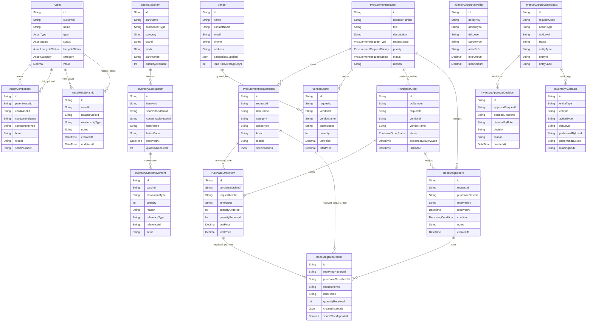

# OpsMind Inventory and Procurement Database Schema

## Overview

OpsMind Inventory and Procurement use PostgreSQL through the Inventory backend Prisma schema at `Services/inventory-backend/prisma/schema.prisma`. This document is generated from the current implementation and intentionally separates implemented schema from future/planned schema extensions.

The implemented schema covers assets, components, accessories, licenses, consumables, spare stock, procurement requests, request items, vendor quotes, purchase orders, receiving records, FIFO stock batches and movements, CMDB relationships, custody/transfer/history, maintenance, lifecycle/EOL analytics, audit sessions, alerts, finance/budget foundations, supplier/RFQ foundations, and RBAC approval governance.

Important representation note: accessories, licenses, and consumables do not have separate dedicated Prisma models. They are represented by the shared `Asset` model using `AssetCategory` values such as `ACCESSORY`, `LICENSE`, and `CONSUMABLE`, plus relationship/component records where needed. Spare stock has a dedicated `SpareStockItem` model.

## Source Files Inspected

- `Services/inventory-backend/prisma/schema.prisma`
- `Services/inventory-backend/prisma/migrations/`
- `Services/inventory-backend/src/server.ts`
- `Services/inventory-backend/src/services/inventoryApprovalService.ts`
- `Services/inventory-backend/tests/`
- `docs/inventory-ux/`
- `docs/thesis/inventory_procurement_update_pack.md`

## Implemented Enums

- `AssetType`: `LAPTOP`, `DESKTOP`, `TABLET`, `SERVER`, `MONITOR`, `PERIPHERAL`, `KEYBOARD`, `ELECTRONICS`, `PROJECTOR`, `SMARTBOARD`, `CAMERA`, `SPEAKER`, `MICROPHONE`, `ROUTER`, `SWITCH`, `ACCESS_POINT`, `FIREWALL`, `PRINTER`, `SCANNER`, `DESK`, `CHAIR`, `WHITEBOARD`, `FILING_CABINET`, `FURNITURE`, `MICROSCOPE`, `CENTRIFUGE`, `OSCILLOSCOPE`, `THREE_D_PRINTER`, `LAB_BENCH`, `VEHICLE`, `GENERATOR`, `HVAC`, `MAINTENANCE_TOOL`
- `AssetStatus`: `ACTIVE`, `REPAIR`, `RETIRED`, `ASSIGNED`, `MAINTENANCE`
- `AssetCategory`: `ASSET`, `COMPONENT`, `ACCESSORY`, `CONSUMABLE`, `LICENSE`, `SPARE_PART`
- `AssetLifecycleStatus`: `IN_STOCK`, `ASSIGNED`, `IN_USE`, `UNDER_MAINTENANCE`, `PENDING_REPAIR`, `IN_TRANSIT`, `RESERVED`, `RETIRED`, `DISPOSED`, `LOST_STOLEN`, `EOL_EXPIRED`
- `AssetCustodyStatus`: `UNASSIGNED`, `CHECKED_OUT`, `RETURNED`
- `AssetLocation`: `CENTRAL_WAREHOUSE`, `MAIN_BUILDING`, `K_BUILDING`, `N_BUILDING`, `S_BUILDING`, `R_BUILDING`, `PHARMACY_BUILDING`
- `AssetDepartment`: `COMPUTER_SCIENCE`, `ENGINEERING`, `ARCHITECTURE`, `BUSINESS`, `MASS_COMM`, `ALSUN`, `PHARMACY`, `DENTISTRY`, `UNASSIGNED`, `GENERAL`
- `TicketStatus`: `OPEN`, `IN_PROGRESS`, `RESOLVED`, `CLOSED`
- `TicketPriority`: `LOW`, `MEDIUM`, `HIGH`, `CRITICAL`
- `TicketType`: `HARDWARE`, `SOFTWARE`, `NETWORK`, `ACCESS`, `OTHER`
- `ProcurementRequestType`: `REPLACEMENT`, `SPARE_STOCK`, `CONSUMABLE_RESTOCK`, `LICENSE_RENEWAL`, `NEW_PURCHASE`, `MAINTENANCE_RELATED`, `AUDIT_RELATED`, `OTHER`
- `ProcurementRequestPriority`: `LOW`, `MEDIUM`, `HIGH`, `CRITICAL`
- `ProcurementRequestStatus`: `DRAFT`, `SUBMITTED`, `UNDER_REVIEW`, `APPROVED`, `REJECTED`, `ORDERED`, `PARTIALLY_RECEIVED`, `RECEIVED`, `CLOSED`, `CANCELLED`
- `ProcurementRequestSource`: `MANUAL`, `AI_RECOMMENDATION`, `LOW_STOCK`, `EOL`, `AUDIT`, `MAINTENANCE`, `IMPORT`
- `ProcurementApprovalDecision`: `SUBMIT`, `APPROVE`, `REJECT`, `CANCEL`, `REOPEN`, `MARK_ORDERED`, `MARK_RECEIVED`, `CLOSE`, `UPDATE`
- `VendorQuoteStatus`: `PENDING`, `SELECTED`, `REJECTED`
- `PurchaseOrderStatus`: `DRAFT`, `ISSUED`, `PARTIALLY_RECEIVED`, `RECEIVED`, `CANCELLED`
- `ReceivingCondition`: `GOOD`, `DAMAGED`, `PARTIAL`, `NEEDS_INSPECTION`
- `ProcurementAssetRelationshipType`: `REPLACES`, `REQUESTED_FOR`, `RELATED_TO`, `CAUSED_BY_AUDIT`, `CAUSED_BY_MAINTENANCE`, `EOL_REPLACEMENT`, `LOW_STOCK_RESTOCK`, `LICENSE_RENEWAL`
- `ProcurementRecommendationReviewStatus`: `NEW`, `REVIEWED`, `CONVERTED`, `IGNORED`
- `InventoryAbcClass`: `A`, `B`, `C`, `UNCLASSIFIED`
- `ProcurementFinanceStatus`: `NOT_SUBMITTED`, `PENDING_BUDGET_REVIEW`, `BUDGET_APPROVED`, `BUDGET_REJECTED`, `INVOICED`, `PAYMENT_PENDING`, `PAID`, `CANCELLED`
- `ProcurementRfqStatus`: `DRAFT`, `SENT`, `CLOSED`, `CANCELLED`

## Entity Groups

### A. Core Inventory Asset Models

- `Asset`

### B. CMDB / Relationship Models

- `AssetRelationship`
- `AssetComponent`
- `AssetTicket`
- `Ticket`

### C. Components / Accessories / Licenses

- `Asset`
- `AssetComponent`
- `AssetRelationship`

### D. Consumables and Spare Stock

- `Asset`
- `SpareStockItem`

### E. Transfer / Custody / Loaner Models

- `AssetCustodyEvent`

### F. Maintenance / Lifecycle / EOL Models

- `AssetLifecycleEvent`
- `AssetMaintenanceRecord`
- `AssetLifecycleOutcome`
- `AssetLifespanPrediction`
- `AssetEolAssessment`
- `AssetProcurementCandidate`
- `AssetHistory`

### G. Procurement Models

- `ProcurementRequest`
- `ProcurementRequestItem`
- `ProcurementApproval`
- `ProcurementAssetLink`
- `ProcurementRecommendationReview`

### H. Purchase Order / Vendor / Quote Models

- `Vendor`
- `VendorQuote`
- `PurchaseOrder`
- `PurchaseOrderItem`
- `SupplierCatalogItem`
- `ProcurementRfq`
- `ProcurementRfqInvitation`

### I. Receiving / Warehouse / Stock Movement Models

- `ReceivingRecord`
- `ReceivingRecordItem`
- `InventoryStockBatch`
- `InventoryStockMovement`
- `SpareStockItem`

### J. AI / Telemetry / Analytics Models

- `AssetSpecSnapshot`
- `AssetSpecEvidence`
- `AssetTelemetrySample`
- `InventoryAiJob`
- `InventoryAlertRule`
- `InventoryAlertEvent`

### K. RBAC Approval Governance Models

- `InventoryApprovalPolicy`
- `InventoryApprovalRequest`
- `InventoryApprovalDecision`
- `InventoryAuditLog`
- `InventoryUserScope`

### L. Audit / History Models

- `InventoryAuditLog`
- `AssetHistory`
- `AssetLifecycleEvent`
- `InventoryAuditSession`
- `InventoryAuditSessionItem`
- `InventoryAlertEvent`

### M. Import / Batch / Data Quality Models

- `Asset`
- `AssetSpecSnapshot`
- `AssetSpecEvidence`
- `InventoryAiJob`
- `InventoryAuditLog`

### N. Finance / Budget / Invoice Foundation

- `CostCenter`
- `BudgetPeriod`
- `BudgetAllocation`
- `BudgetUsage`
- `ProcurementInvoice`
- `ProcurementInvoiceLine`

## Model Details

### `Asset`

- Table: `assets`
- Purpose: Canonical asset/inventory record for parent assets, components, accessories, consumables, licenses, and spare-part style assets.
- Primary key: `id`

| Field | Type | Required | Relation / Meaning |
| ----- | ---- | -------- | ------------------ |
| `id` | `String` | Defaulted | Primary key; Defaulted |
| `customId` | `String` | Yes | Unique |
| `name` | `String` | Yes | Business data field |
| `type` | `AssetType` | Yes | Enum `AssetType` |
| `status` | `AssetStatus` | Defaulted | Defaulted; Enum `AssetStatus` |
| `lifecycleStatus` | `AssetLifecycleStatus` | Defaulted | Defaulted; Enum `AssetLifecycleStatus` |
| `category` | `AssetCategory` | Defaulted | Defaulted; Enum `AssetCategory` |
| `value` | `Decimal` | Defaulted | Defaulted |
| `quantity` | `Int` | Defaulted | Defaulted |
| `assignedUser` | `String?` | No | Business data field |
| `serialNumber` | `String?` | No | Business data field |
| `assetTag` | `String?` | No | Business data field |
| `manufacturerPartNumber` | `String?` | No | Business data field |
| `location` | `AssetLocation` | Yes | Enum `AssetLocation` |
| `department` | `AssetDepartment` | Yes | Enum `AssetDepartment` |
| `assignedToName` | `String?` | No | Business data field |
| `assignedToUserId` | `String?` | No | Business data field |
| `assignedDepartment` | `String?` | No | Business data field |
| `checkoutDate` | `DateTime?` | No | Business data field |
| `expectedReturnDate` | `DateTime?` | No | Business data field |
| `returnedDate` | `DateTime?` | No | Business data field |
| `custodyStatus` | `AssetCustodyStatus` | Defaulted | Defaulted; Enum `AssetCustodyStatus` |
| `purchaseDate` | `DateTime?` | No | Business data field |
| `vendor` | `String?` | No | Business data field |
| `purchaseCost` | `Decimal?` | No | Business data field |
| `invoiceNumber` | `String?` | No | Business data field |
| `purchaseOrderNumber` | `String?` | No | Business data field |
| `warrantyStartDate` | `DateTime?` | No | Business data field |
| `warrantyEndDate` | `DateTime?` | No | Business data field |
| `replacementCost` | `Decimal?` | No | Business data field |
| `specifications` | `Json` | Defaulted | Defaulted |
| `createdAt` | `DateTime` | Defaulted | Defaulted |
| `updatedAt` | `DateTime` | Defaulted | Auto-updated timestamp |
| `histories` | `AssetHistory[]` | Relation list | Back-reference relation list |
| `assetTickets` | `AssetTicket[]` | Relation list | Back-reference relation list |
| `relatedTickets` | `Ticket[]` | Relation list | Back-reference relation list |
| `lifecycleOutcome` | `AssetLifecycleOutcome?` | No | Business data field |
| `specSnapshots` | `AssetSpecSnapshot[]` | Relation list | Back-reference relation list |
| `specEvidence` | `AssetSpecEvidence[]` | Relation list | Back-reference relation list |
| `telemetrySamples` | `AssetTelemetrySample[]` | Relation list | Back-reference relation list |
| `lifespanPredictions` | `AssetLifespanPrediction[]` | Relation list | Back-reference relation list |
| `eolAssessments` | `AssetEolAssessment[]` | Relation list | Back-reference relation list |
| `procurementCandidates` | `AssetProcurementCandidate[]` | Relation list | Back-reference relation list |
| `aiJobs` | `InventoryAiJob[]` | Relation list | Back-reference relation list |
| `componentsAsParent` | `AssetComponent[]` | Relation list | Relation field; Back-reference relation list |
| `componentsAsChild` | `AssetComponent[]` | Relation list | Relation field; Back-reference relation list |
| `lifecycleEvents` | `AssetLifecycleEvent[]` | Relation list | Back-reference relation list |
| `maintenanceRecords` | `AssetMaintenanceRecord[]` | Relation list | Back-reference relation list |
| `custodyEvents` | `AssetCustodyEvent[]` | Relation list | Back-reference relation list |
| `relationshipsFrom` | `AssetRelationship[]` | Relation list | Relation field; Back-reference relation list |
| `relationshipsTo` | `AssetRelationship[]` | Relation list | Relation field; Back-reference relation list |

### `AssetComponent`

- Table: `asset_components`
- Purpose: Installed or linked component record under a parent asset, optionally linked to a child Asset row.
- Primary key: `id`

| Field | Type | Required | Relation / Meaning |
| ----- | ---- | -------- | ------------------ |
| `id` | `String` | Defaulted | Primary key; Defaulted |
| `parentAssetId` | `String` | Yes | Business data field |
| `childAssetId` | `String?` | No | Business data field |
| `componentName` | `String` | Yes | Business data field |
| `componentType` | `String` | Yes | Business data field |
| `brand` | `String?` | No | Business data field |
| `model` | `String?` | No | Business data field |
| `serialNumber` | `String?` | No | Business data field |
| `partNumber` | `String?` | No | Business data field |
| `status` | `String` | Defaulted | Defaulted |
| `condition` | `String?` | No | Business data field |
| `installedAt` | `DateTime?` | No | Business data field |
| `removedAt` | `DateTime?` | No | Business data field |
| `reason` | `String?` | No | Business data field |
| `notes` | `String?` | No | Business data field |
| `createdAt` | `DateTime` | Defaulted | Defaulted |
| `updatedAt` | `DateTime` | Defaulted | Auto-updated timestamp |
| `parentAsset` | `Asset` | Yes | Relation field |
| `childAsset` | `Asset?` | No | Relation field |
| `lifecycleEvents` | `AssetLifecycleEvent[]` | Relation list | Back-reference relation list |
| `maintenanceRecords` | `AssetMaintenanceRecord[]` | Relation list | Back-reference relation list |

### `AssetLifecycleEvent`

- Table: `asset_lifecycle_events`
- Purpose: Chronological lifecycle event log for assets and optionally components.
- Primary key: `id`

| Field | Type | Required | Relation / Meaning |
| ----- | ---- | -------- | ------------------ |
| `id` | `String` | Defaulted | Primary key; Defaulted |
| `assetId` | `String` | Yes | Business data field |
| `componentId` | `String?` | No | Business data field |
| `eventType` | `String` | Yes | Business data field |
| `oldValue` | `Json?` | No | Business data field |
| `newValue` | `Json?` | No | Business data field |
| `reason` | `String?` | No | Business data field |
| `notes` | `String?` | No | Business data field |
| `actor` | `String?` | No | Business data field |
| `createdAt` | `DateTime` | Defaulted | Defaulted |
| `asset` | `Asset` | Yes | Relation field |
| `component` | `AssetComponent?` | No | Relation field |

### `AssetMaintenanceRecord`

- Table: `asset_maintenance_records`
- Purpose: Maintenance/service records for whole assets or specific installed components.
- Primary key: `id`

| Field | Type | Required | Relation / Meaning |
| ----- | ---- | -------- | ------------------ |
| `id` | `String` | Defaulted | Primary key; Defaulted |
| `assetId` | `String` | Yes | Business data field |
| `componentId` | `String?` | No | Business data field |
| `maintenanceType` | `String` | Yes | Business data field |
| `status` | `String` | Defaulted | Defaulted |
| `performedBy` | `String?` | No | Business data field |
| `performedAt` | `DateTime?` | No | Business data field |
| `nextMaintenanceDate` | `DateTime?` | No | Business data field |
| `cost` | `Decimal?` | No | Business data field |
| `reason` | `String?` | No | Business data field |
| `notes` | `String?` | No | Business data field |
| `linkedTicketId` | `String?` | No | Business data field |
| `createdAt` | `DateTime` | Defaulted | Defaulted |
| `updatedAt` | `DateTime` | Defaulted | Auto-updated timestamp |
| `asset` | `Asset` | Yes | Relation field |
| `component` | `AssetComponent?` | No | Relation field |

### `AssetCustodyEvent`

- Table: `asset_custody_events`
- Purpose: Checkout, check-in, transfer, loaner, assignment, and custody history evidence.
- Primary key: `id`

| Field | Type | Required | Relation / Meaning |
| ----- | ---- | -------- | ------------------ |
| `id` | `String` | Defaulted | Primary key; Defaulted |
| `assetId` | `String` | Yes | Business data field |
| `action` | `String` | Yes | Business data field |
| `assignedToName` | `String?` | No | Business data field |
| `assignedToUserId` | `String?` | No | Business data field |
| `assignedDepartment` | `String?` | No | Business data field |
| `checkoutDate` | `DateTime?` | No | Business data field |
| `expectedReturnDate` | `DateTime?` | No | Business data field |
| `returnedDate` | `DateTime?` | No | Business data field |
| `conditionOut` | `String?` | No | Business data field |
| `conditionIn` | `String?` | No | Business data field |
| `reason` | `String?` | No | Business data field |
| `notes` | `String?` | No | Business data field |
| `actor` | `String?` | No | Business data field |
| `createdAt` | `DateTime` | Defaulted | Defaulted |
| `asset` | `Asset` | Yes | Relation field |

### `AssetRelationship`

- Table: `asset_relationships`
- Purpose: Generic CMDB relationship between two asset records such as accessory/license/related-to links.
- Primary key: `id`

| Field | Type | Required | Relation / Meaning |
| ----- | ---- | -------- | ------------------ |
| `id` | `String` | Defaulted | Primary key; Defaulted |
| `assetId` | `String` | Yes | Business data field |
| `relatedAssetId` | `String` | Yes | Business data field |
| `relationshipType` | `String` | Yes | Business data field |
| `notes` | `String?` | No | Business data field |
| `createdAt` | `DateTime` | Defaulted | Defaulted |
| `updatedAt` | `DateTime` | Defaulted | Auto-updated timestamp |
| `asset` | `Asset` | Yes | Relation field |
| `relatedAsset` | `Asset` | Yes | Relation field |

### `SpareStockItem`

- Table: `spare_stock_items`
- Purpose: Warehouse spare-stock master item with reorder, EOQ/MOQ, ABC, and compatibility fields.
- Primary key: `id`

| Field | Type | Required | Relation / Meaning |
| ----- | ---- | -------- | ------------------ |
| `id` | `String` | Defaulted | Primary key; Defaulted |
| `partName` | `String` | Yes | Business data field |
| `componentType` | `String` | Yes | Business data field |
| `category` | `String?` | No | Business data field |
| `brand` | `String?` | No | Business data field |
| `model` | `String?` | No | Business data field |
| `partNumber` | `String?` | No | Business data field |
| `quantityAvailable` | `Int` | Defaulted | Defaulted |
| `minimumStockLevel` | `Int` | Defaulted | Defaulted |
| `reorderPoint` | `Int?` | No | Business data field |
| `safetyStock` | `Int?` | No | Business data field |
| `annualDemand` | `Int?` | No | Business data field |
| `orderingCost` | `Decimal?` | No | Business data field |
| `holdingCost` | `Decimal?` | No | Business data field |
| `minimumOrderQuantity` | `Int?` | No | Business data field |
| `minimumOrderValue` | `Decimal?` | No | Business data field |
| `packSize` | `Int?` | No | Business data field |
| `leadTimeDays` | `Int?` | No | Business data field |
| `abcClass` | `InventoryAbcClass` | Defaulted | Defaulted; Enum `InventoryAbcClass` |
| `abcReason` | `String?` | No | Business data field |
| `location` | `String?` | No | Business data field |
| `vendor` | `String?` | No | Business data field |
| `unitCost` | `Decimal?` | No | Business data field |
| `compatibleAssetTypes` | `Json?` | No | Business data field |
| `compatibleBrandsModels` | `Json?` | No | Business data field |
| `notes` | `String?` | No | Business data field |
| `createdAt` | `DateTime` | Defaulted | Defaulted |
| `updatedAt` | `DateTime` | Defaulted | Auto-updated timestamp |
| `stockBatches` | `InventoryStockBatch[]` | Relation list | Back-reference relation list |

### `AssetSpecSnapshot`

- Table: `asset_spec_snapshots`
- Purpose: Normalized specification verification snapshot for Inventory AI/spec workflows.
- Primary key: `id`

| Field | Type | Required | Relation / Meaning |
| ----- | ---- | -------- | ------------------ |
| `id` | `String` | Defaulted | Primary key; Defaulted |
| `assetId` | `String` | Yes | Business data field |
| `normalizedSpecs` | `Json` | Defaulted | Defaulted |
| `lookupMode` | `String` | Defaulted | Defaulted |
| `verificationStatus` | `String` | Defaulted | Defaulted |
| `confidence` | `Float?` | No | Business data field |
| `evidenceStatus` | `String` | Defaulted | Defaulted |
| `evidenceReason` | `String?` | No | Business data field |
| `provider` | `String?` | No | Business data field |
| `ruleVersion` | `String?` | No | Business data field |
| `variant` | `String?` | No | Business data field |
| `snapshotHash` | `String?` | No | Business data field |
| `reviewedBy` | `String?` | No | Business data field |
| `reviewedAt` | `DateTime?` | No | Business data field |
| `createdAt` | `DateTime` | Defaulted | Defaulted |
| `updatedAt` | `DateTime` | Defaulted | Auto-updated timestamp |
| `asset` | `Asset` | Yes | Relation field |
| `evidenceRows` | `AssetSpecEvidence[]` | Relation list | Back-reference relation list |

### `AssetSpecEvidence`

- Table: `asset_spec_evidence`
- Purpose: Evidence sources used to support a specification snapshot.
- Primary key: `id`

| Field | Type | Required | Relation / Meaning |
| ----- | ---- | -------- | ------------------ |
| `id` | `String` | Defaulted | Primary key; Defaulted |
| `snapshotId` | `String` | Yes | Business data field |
| `assetId` | `String` | Yes | Business data field |
| `provider` | `String?` | No | Business data field |
| `sourceUrl` | `String` | Yes | Business data field |
| `sourceDomain` | `String?` | No | Business data field |
| `fetchedAt` | `DateTime?` | No | Business data field |
| `contentHash` | `String?` | No | Business data field |
| `extractedFields` | `Json?` | No | Business data field |
| `sourceConfidence` | `Float?` | No | Business data field |
| `isTrusted` | `Boolean` | Defaulted | Defaulted |
| `createdAt` | `DateTime` | Defaulted | Defaulted |
| `snapshot` | `AssetSpecSnapshot` | Yes | Relation field |
| `asset` | `Asset` | Yes | Relation field |

### `AssetTelemetrySample`

- Table: `asset_telemetry_samples`
- Purpose: Telemetry/last-seen/utilization sample for an asset.
- Primary key: `id`

| Field | Type | Required | Relation / Meaning |
| ----- | ---- | -------- | ------------------ |
| `id` | `String` | Defaulted | Primary key; Defaulted |
| `assetId` | `String` | Yes | Business data field |
| `observedAt` | `DateTime` | Yes | Business data field |
| `telemetrySource` | `String` | Yes | Business data field |
| `rawSignals` | `Json` | Defaulted | Defaulted |
| `derivedStatus` | `String` | Yes | Business data field |
| `confidence` | `Float?` | No | Business data field |
| `reason` | `String?` | No | Business data field |
| `activeHours` | `Float?` | No | Business data field |
| `idleHours` | `Float?` | No | Business data field |
| `offlineHours` | `Float?` | No | Business data field |
| `utilization` | `Json?` | No | Business data field |
| `consumptionScore` | `Float?` | No | Business data field |
| `qualityImpactScore` | `Float?` | No | Business data field |
| `sampleHash` | `String?` | No | Business data field |
| `createdAt` | `DateTime` | Defaulted | Defaulted |
| `asset` | `Asset` | Yes | Relation field |

### `AssetLifespanPrediction`

- Table: `asset_lifespan_predictions`
- Purpose: AI/deterministic lifespan prediction and explanation record.
- Primary key: `id`

| Field | Type | Required | Relation / Meaning |
| ----- | ---- | -------- | ------------------ |
| `id` | `String` | Defaulted | Primary key; Defaulted |
| `assetId` | `String` | Yes | Business data field |
| `predictedLifespanYears` | `Float` | Yes | Business data field |
| `predictedEolDate` | `DateTime?` | No | Business data field |
| `monthsRemaining` | `Float?` | No | Business data field |
| `failureRisk` | `Float?` | No | Business data field |
| `qualityTier` | `String?` | No | Business data field |
| `confidence` | `Float?` | No | Business data field |
| `evidenceLevel` | `String?` | No | Business data field |
| `modelVersion` | `String?` | No | Business data field |
| `predictionSource` | `String` | Yes | Business data field |
| `trigger` | `String` | Yes | Business data field |
| `reason` | `String?` | No | Business data field |
| `explanation` | `String?` | No | Business data field |
| `workingHours` | `Float?` | No | Business data field |
| `operationalState` | `String?` | No | Business data field |
| `telemetryStatus` | `String?` | No | Business data field |
| `specEvidenceStatus` | `String?` | No | Business data field |
| `isDisplayOnly` | `Boolean` | Defaulted | Defaulted |
| `previousPredictionId` | `String?` | No | Business data field |
| `deltaLifespanYears` | `Float?` | No | Business data field |
| `deltaMonthsRemaining` | `Float?` | No | Business data field |
| `generatedBy` | `String?` | No | Business data field |
| `provider` | `String?` | No | Business data field |
| `requestId` | `String?` | No | Business data field |
| `createdAt` | `DateTime` | Defaulted | Defaulted |
| `asset` | `Asset` | Yes | Relation field |
| `previousPrediction` | `AssetLifespanPrediction?` | No | Relation field |
| `nextPredictions` | `AssetLifespanPrediction[]` | Relation list | Relation field; Back-reference relation list |

### `AssetEolAssessment`

- Table: `asset_eol_assessments`
- Purpose: EOL assessment used for lifecycle and procurement planning.
- Primary key: `id`

| Field | Type | Required | Relation / Meaning |
| ----- | ---- | -------- | ------------------ |
| `id` | `String` | Defaulted | Primary key; Defaulted |
| `assetId` | `String` | Yes | Business data field |
| `status` | `String` | Yes | Business data field |
| `predictedEolDate` | `DateTime?` | No | Business data field |
| `monthsRemaining` | `Float?` | No | Business data field |
| `confidence` | `Float` | Yes | Business data field |
| `reason` | `String` | Yes | Business data field |
| `evidenceLevel` | `String` | Yes | Business data field |
| `predictionSource` | `String` | Yes | Business data field |
| `telemetryStatus` | `String` | Yes | Business data field |
| `specEvidenceStatus` | `String` | Yes | Business data field |
| `suitableForProcurementPlanning` | `Boolean` | Defaulted | Defaulted |
| `procurementRecommended` | `Boolean` | Defaulted | Defaulted |
| `procurementWindowMonths` | `Int?` | No | Business data field |
| `generatedAt` | `DateTime` | Yes | Business data field |
| `createdAt` | `DateTime` | Defaulted | Defaulted |
| `updatedAt` | `DateTime` | Defaulted | Auto-updated timestamp |
| `asset` | `Asset` | Yes | Relation field |
| `procurementCandidates` | `AssetProcurementCandidate[]` | Relation list | Back-reference relation list |

### `AssetProcurementCandidate`

- Table: `asset_procurement_candidates`
- Purpose: Asset-level candidate recommendation for procurement/replacement planning.
- Primary key: `id`

| Field | Type | Required | Relation / Meaning |
| ----- | ---- | -------- | ------------------ |
| `id` | `String` | Defaulted | Primary key; Defaulted |
| `assetId` | `String` | Yes | Business data field |
| `eolAssessmentId` | `String?` | No | Business data field |
| `candidateStatus` | `String` | Defaulted | Defaulted |
| `predictedEolDate` | `DateTime?` | No | Business data field |
| `confidence` | `Float?` | No | Business data field |
| `reason` | `String?` | No | Business data field |
| `procurementWindowMonths` | `Int?` | No | Business data field |
| `recommendedAt` | `DateTime` | Defaulted | Defaulted |
| `acknowledgedAt` | `DateTime?` | No | Business data field |
| `acknowledgedBy` | `String?` | No | Business data field |
| `dismissedAt` | `DateTime?` | No | Business data field |
| `dismissedBy` | `String?` | No | Business data field |
| `createdAt` | `DateTime` | Defaulted | Defaulted |
| `updatedAt` | `DateTime` | Defaulted | Auto-updated timestamp |
| `asset` | `Asset` | Yes | Relation field |
| `eolAssessment` | `AssetEolAssessment?` | No | Relation field |

### `ProcurementRequest`

- Table: `procurement_requests`
- Purpose: Main procurement demand/request record and lifecycle aggregate.
- Primary key: `id`

| Field | Type | Required | Relation / Meaning |
| ----- | ---- | -------- | ------------------ |
| `id` | `String` | Defaulted | Primary key; Defaulted |
| `requestNumber` | `String` | Yes | Unique |
| `title` | `String` | Yes | Business data field |
| `description` | `String?` | No | Business data field |
| `requestType` | `ProcurementRequestType` | Defaulted | Defaulted; Enum `ProcurementRequestType` |
| `priority` | `ProcurementRequestPriority` | Defaulted | Defaulted; Enum `ProcurementRequestPriority` |
| `status` | `ProcurementRequestStatus` | Defaulted | Defaulted; Enum `ProcurementRequestStatus` |
| `reason` | `String` | Yes | Business data field |
| `requestedBy` | `String` | Yes | Business data field |
| `department` | `String?` | No | Business data field |
| `building` | `String?` | No | Business data field |
| `room` | `String?` | No | Business data field |
| `neededByDate` | `DateTime?` | No | Business data field |
| `estimatedBudget` | `Decimal?` | No | Business data field |
| `actualCost` | `Decimal?` | No | Business data field |
| `abcClass` | `InventoryAbcClass` | Defaulted | Defaulted; Enum `InventoryAbcClass` |
| `abcReason` | `String?` | No | Business data field |
| `controlLevel` | `String?` | No | Business data field |
| `financeStatus` | `ProcurementFinanceStatus` | Defaulted | Defaulted; Enum `ProcurementFinanceStatus` |
| `costCenterId` | `String?` | No | Business data field |
| `budgetAllocationId` | `String?` | No | Business data field |
| `budgetAmountReserved` | `Decimal?` | No | Business data field |
| `financeNotes` | `String?` | No | Business data field |
| `financeMetadata` | `Json?` | No | Business data field |
| `source` | `ProcurementRequestSource` | Defaulted | Defaulted; Enum `ProcurementRequestSource` |
| `aiRecommendationId` | `String?` | No | Business data field |
| `metadata` | `Json?` | No | Business data field |
| `createdAt` | `DateTime` | Defaulted | Defaulted |
| `updatedAt` | `DateTime` | Defaulted | Auto-updated timestamp |
| `items` | `ProcurementRequestItem[]` | Relation list | Back-reference relation list |
| `approvals` | `ProcurementApproval[]` | Relation list | Back-reference relation list |
| `vendorQuotes` | `VendorQuote[]` | Relation list | Back-reference relation list |
| `purchaseOrders` | `PurchaseOrder[]` | Relation list | Back-reference relation list |
| `receivingRecords` | `ReceivingRecord[]` | Relation list | Back-reference relation list |
| `assetLinks` | `ProcurementAssetLink[]` | Relation list | Back-reference relation list |
| `recommendationReviews` | `ProcurementRecommendationReview[]` | Relation list | Back-reference relation list |
| `costCenter` | `CostCenter?` | No | Relation field |
| `budgetAllocation` | `BudgetAllocation?` | No | Relation field |
| `rfqs` | `ProcurementRfq[]` | Relation list | Back-reference relation list |
| `invoices` | `ProcurementInvoice[]` | Relation list | Back-reference relation list |

### `ProcurementRequestItem`

- Table: `procurement_request_items`
- Purpose: Line item requested under a procurement request, including EOQ/MOQ/ABC fields.
- Primary key: `id`

| Field | Type | Required | Relation / Meaning |
| ----- | ---- | -------- | ------------------ |
| `id` | `String` | Defaulted | Primary key; Defaulted |
| `requestId` | `String` | Yes | Business data field |
| `itemName` | `String` | Yes | Business data field |
| `category` | `String?` | No | Business data field |
| `assetType` | `String?` | No | Business data field |
| `brand` | `String?` | No | Business data field |
| `model` | `String?` | No | Business data field |
| `specifications` | `Json?` | No | Business data field |
| `quantityRequested` | `Int` | Yes | Business data field |
| `quantityApproved` | `Int?` | No | Business data field |
| `quantityOrdered` | `Int?` | No | Business data field |
| `quantityReceived` | `Int` | Defaulted | Defaulted |
| `unitEstimatedCost` | `Decimal?` | No | Business data field |
| `unitActualCost` | `Decimal?` | No | Business data field |
| `annualDemand` | `Int?` | No | Business data field |
| `orderingCost` | `Decimal?` | No | Business data field |
| `holdingCost` | `Decimal?` | No | Business data field |
| `calculatedEoq` | `Decimal?` | No | Business data field |
| `recommendedOrderQuantity` | `Int?` | No | Business data field |
| `reorderPointValue` | `Int?` | No | Business data field |
| `safetyStock` | `Int?` | No | Business data field |
| `demandSource` | `String?` | No | Business data field |
| `dataQuality` | `String?` | No | Business data field |
| `minimumOrderQuantity` | `Int?` | No | Business data field |
| `minimumOrderValue` | `Decimal?` | No | Business data field |
| `packSize` | `Int?` | No | Business data field |
| `leadTimeDays` | `Int?` | No | Business data field |
| `abcClass` | `InventoryAbcClass` | Defaulted | Defaulted; Enum `InventoryAbcClass` |
| `abcReason` | `String?` | No | Business data field |
| `linkedAssetTag` | `String?` | No | Business data field |
| `linkedSpareStockId` | `String?` | No | Business data field |
| `linkedConsumableId` | `String?` | No | Business data field |
| `linkedLicenseId` | `String?` | No | Business data field |
| `notes` | `String?` | No | Business data field |
| `createdAt` | `DateTime` | Defaulted | Defaulted |
| `updatedAt` | `DateTime` | Defaulted | Auto-updated timestamp |
| `request` | `ProcurementRequest` | Yes | Relation field |
| `purchaseOrderItems` | `PurchaseOrderItem[]` | Relation list | Back-reference relation list |
| `receivingItems` | `ReceivingRecordItem[]` | Relation list | Back-reference relation list |
| `invoiceLines` | `ProcurementInvoiceLine[]` | Relation list | Back-reference relation list |

### `ProcurementApproval`

- Table: `procurement_approvals`
- Purpose: Procurement request lifecycle/status decision history.
- Primary key: `id`

| Field | Type | Required | Relation / Meaning |
| ----- | ---- | -------- | ------------------ |
| `id` | `String` | Defaulted | Primary key; Defaulted |
| `requestId` | `String` | Yes | Business data field |
| `fromStatus` | `ProcurementRequestStatus?` | No | Enum `ProcurementRequestStatus` |
| `toStatus` | `ProcurementRequestStatus` | Yes | Enum `ProcurementRequestStatus` |
| `decision` | `ProcurementApprovalDecision` | Yes | Enum `ProcurementApprovalDecision` |
| `decidedBy` | `String` | Yes | Business data field |
| `decisionNote` | `String?` | No | Business data field |
| `createdAt` | `DateTime` | Defaulted | Defaulted |
| `request` | `ProcurementRequest` | Yes | Relation field |

### `Vendor`

- Table: `procurement_vendors`
- Purpose: Vendor/supplier master data.
- Primary key: `id`

| Field | Type | Required | Relation / Meaning |
| ----- | ---- | -------- | ------------------ |
| `id` | `String` | Defaulted | Primary key; Defaulted |
| `name` | `String` | Yes | Business data field |
| `contactName` | `String?` | No | Business data field |
| `email` | `String?` | No | Business data field |
| `phone` | `String?` | No | Business data field |
| `address` | `String?` | No | Business data field |
| `categoriesSupplied` | `Json?` | No | Business data field |
| `leadTimeAverageDays` | `Int?` | No | Business data field |
| `warrantyQualityScore` | `Float?` | No | Business data field |
| `active` | `Boolean` | Defaulted | Defaulted |
| `reliabilityScore` | `Float?` | No | Business data field |
| `notes` | `String?` | No | Business data field |
| `createdAt` | `DateTime` | Defaulted | Defaulted |
| `updatedAt` | `DateTime` | Defaulted | Auto-updated timestamp |
| `quotes` | `VendorQuote[]` | Relation list | Back-reference relation list |
| `purchaseOrders` | `PurchaseOrder[]` | Relation list | Back-reference relation list |
| `catalogItems` | `SupplierCatalogItem[]` | Relation list | Back-reference relation list |
| `rfqInvitations` | `ProcurementRfqInvitation[]` | Relation list | Back-reference relation list |
| `invoices` | `ProcurementInvoice[]` | Relation list | Back-reference relation list |

### `VendorQuote`

- Table: `procurement_vendor_quotes`
- Purpose: Vendor quote for a procurement request and quote-comparison workflow.
- Primary key: `id`

| Field | Type | Required | Relation / Meaning |
| ----- | ---- | -------- | ------------------ |
| `id` | `String` | Defaulted | Primary key; Defaulted |
| `requestId` | `String` | Yes | Business data field |
| `vendorId` | `String?` | No | Business data field |
| `vendorName` | `String` | Yes | Business data field |
| `quotedItem` | `String` | Yes | Business data field |
| `quantity` | `Int` | Yes | Business data field |
| `unitPrice` | `Decimal?` | No | Business data field |
| `totalPrice` | `Decimal?` | No | Business data field |
| `currency` | `String` | Defaulted | Defaulted |
| `minimumOrderQuantity` | `Int?` | No | Business data field |
| `minimumOrderValue` | `Decimal?` | No | Business data field |
| `packSize` | `Int?` | No | Business data field |
| `leadTimeDays` | `Int?` | No | Business data field |
| `bulkDiscountAvailable` | `Boolean?` | No | Business data field |
| `warrantyMonths` | `Int?` | No | Business data field |
| `deliveryDays` | `Int?` | No | Business data field |
| `validUntil` | `DateTime?` | No | Business data field |
| `status` | `VendorQuoteStatus` | Defaulted | Defaulted; Enum `VendorQuoteStatus` |
| `rejectionReason` | `String?` | No | Business data field |
| `notes` | `String?` | No | Business data field |
| `createdAt` | `DateTime` | Defaulted | Defaulted |
| `updatedAt` | `DateTime` | Defaulted | Auto-updated timestamp |
| `request` | `ProcurementRequest` | Yes | Relation field |
| `vendor` | `Vendor?` | No | Relation field |

### `PurchaseOrder`

- Table: `procurement_purchase_orders`
- Purpose: Purchase order linked to a procurement request and vendor.
- Primary key: `id`

| Field | Type | Required | Relation / Meaning |
| ----- | ---- | -------- | ------------------ |
| `id` | `String` | Defaulted | Primary key; Defaulted |
| `poNumber` | `String` | Yes | Unique |
| `requestId` | `String` | Yes | Business data field |
| `vendorId` | `String?` | No | Business data field |
| `vendorName` | `String` | Yes | Business data field |
| `status` | `PurchaseOrderStatus` | Defaulted | Defaulted; Enum `PurchaseOrderStatus` |
| `expectedDeliveryDate` | `DateTime?` | No | Business data field |
| `issuedAt` | `DateTime?` | No | Business data field |
| `notes` | `String?` | No | Business data field |
| `createdAt` | `DateTime` | Defaulted | Defaulted |
| `updatedAt` | `DateTime` | Defaulted | Auto-updated timestamp |
| `request` | `ProcurementRequest` | Yes | Relation field |
| `vendor` | `Vendor?` | No | Relation field |
| `items` | `PurchaseOrderItem[]` | Relation list | Back-reference relation list |
| `receivingRecords` | `ReceivingRecord[]` | Relation list | Back-reference relation list |
| `invoices` | `ProcurementInvoice[]` | Relation list | Back-reference relation list |

### `PurchaseOrderItem`

- Table: `procurement_purchase_order_items`
- Purpose: Purchase order line item optionally tied back to a request item.
- Primary key: `id`

| Field | Type | Required | Relation / Meaning |
| ----- | ---- | -------- | ------------------ |
| `id` | `String` | Defaulted | Primary key; Defaulted |
| `purchaseOrderId` | `String` | Yes | Business data field |
| `requestItemId` | `String?` | No | Business data field |
| `itemName` | `String` | Yes | Business data field |
| `quantityOrdered` | `Int` | Yes | Business data field |
| `quantityReceived` | `Int` | Defaulted | Defaulted |
| `unitPrice` | `Decimal?` | No | Business data field |
| `totalPrice` | `Decimal?` | No | Business data field |
| `notes` | `String?` | No | Business data field |
| `createdAt` | `DateTime` | Defaulted | Defaulted |
| `updatedAt` | `DateTime` | Defaulted | Auto-updated timestamp |
| `purchaseOrder` | `PurchaseOrder` | Yes | Relation field |
| `requestItem` | `ProcurementRequestItem?` | No | Relation field |
| `receivingItems` | `ReceivingRecordItem[]` | Relation list | Back-reference relation list |
| `invoiceLines` | `ProcurementInvoiceLine[]` | Relation list | Back-reference relation list |

### `InventoryStockBatch`

- Table: `inventory_stock_batches`
- Purpose: FIFO-compatible received stock batch/lot for spare stock or consumable-style stock.
- Primary key: `id`

| Field | Type | Required | Relation / Meaning |
| ----- | ---- | -------- | ------------------ |
| `id` | `String` | Defaulted | Primary key; Defaulted |
| `itemKind` | `String` | Yes | Business data field |
| `spareStockItemId` | `String?` | No | Business data field |
| `consumableAssetId` | `String?` | No | Business data field |
| `itemName` | `String` | Yes | Business data field |
| `batchCode` | `String?` | No | Business data field |
| `receivedAt` | `DateTime` | Defaulted | Defaulted |
| `quantityReceived` | `Int` | Yes | Business data field |
| `quantityAvailable` | `Int` | Yes | Business data field |
| `unitCost` | `Decimal?` | No | Business data field |
| `vendor` | `String?` | No | Business data field |
| `location` | `String?` | No | Business data field |
| `warrantyEndDate` | `DateTime?` | No | Business data field |
| `expiryDate` | `DateTime?` | No | Business data field |
| `sourceRequestId` | `String?` | No | Business data field |
| `sourcePurchaseOrderId` | `String?` | No | Business data field |
| `notes` | `String?` | No | Business data field |
| `metadata` | `Json?` | No | Business data field |
| `createdAt` | `DateTime` | Defaulted | Defaulted |
| `updatedAt` | `DateTime` | Defaulted | Auto-updated timestamp |
| `spareStockItem` | `SpareStockItem?` | No | Relation field |
| `movements` | `InventoryStockMovement[]` | Relation list | Back-reference relation list |

### `InventoryStockMovement`

- Table: `inventory_stock_movements`
- Purpose: Stock movement event against a stock batch.
- Primary key: `id`

| Field | Type | Required | Relation / Meaning |
| ----- | ---- | -------- | ------------------ |
| `id` | `String` | Defaulted | Primary key; Defaulted |
| `batchId` | `String` | Yes | Business data field |
| `movementType` | `String` | Yes | Business data field |
| `quantity` | `Int` | Yes | Business data field |
| `reason` | `String?` | No | Business data field |
| `referenceType` | `String?` | No | Business data field |
| `referenceId` | `String?` | No | Business data field |
| `actor` | `String?` | No | Business data field |
| `createdAt` | `DateTime` | Defaulted | Defaulted |
| `batch` | `InventoryStockBatch` | Yes | Relation field |

### `ReceivingRecord`

- Table: `procurement_receiving_records`
- Purpose: Receiving header linked to a procurement request and optional purchase order.
- Primary key: `id`

| Field | Type | Required | Relation / Meaning |
| ----- | ---- | -------- | ------------------ |
| `id` | `String` | Defaulted | Primary key; Defaulted |
| `requestId` | `String` | Yes | Business data field |
| `purchaseOrderId` | `String?` | No | Business data field |
| `receivedBy` | `String` | Yes | Business data field |
| `receivedAt` | `DateTime` | Defaulted | Defaulted |
| `condition` | `ReceivingCondition` | Defaulted | Defaulted; Enum `ReceivingCondition` |
| `notes` | `String?` | No | Business data field |
| `createdAt` | `DateTime` | Defaulted | Defaulted |
| `request` | `ProcurementRequest` | Yes | Relation field |
| `purchaseOrder` | `PurchaseOrder?` | No | Relation field |
| `items` | `ReceivingRecordItem[]` | Relation list | Back-reference relation list |

### `ReceivingRecordItem`

- Table: `procurement_receiving_record_items`
- Purpose: Receiving line item and inventory impact evidence.
- Primary key: `id`

| Field | Type | Required | Relation / Meaning |
| ----- | ---- | -------- | ------------------ |
| `id` | `String` | Defaulted | Primary key; Defaulted |
| `receivingRecordId` | `String` | Yes | Business data field |
| `purchaseOrderItemId` | `String?` | No | Business data field |
| `requestItemId` | `String?` | No | Business data field |
| `itemName` | `String` | Yes | Business data field |
| `quantityReceived` | `Int` | Yes | Business data field |
| `createdAssetIds` | `Json?` | No | Business data field |
| `spareStockUpdated` | `Boolean` | Defaulted | Defaulted |
| `spareStockId` | `String?` | No | Business data field |
| `consumableUpdated` | `Boolean` | Defaulted | Defaulted |
| `consumableId` | `String?` | No | Business data field |
| `licenseCreatedOrUpdated` | `Boolean` | Defaulted | Defaulted |
| `licenseId` | `String?` | No | Business data field |
| `notes` | `String?` | No | Business data field |
| `createdAt` | `DateTime` | Defaulted | Defaulted |
| `receivingRecord` | `ReceivingRecord` | Yes | Relation field |
| `purchaseOrderItem` | `PurchaseOrderItem?` | No | Relation field |
| `requestItem` | `ProcurementRequestItem?` | No | Relation field |

### `ProcurementAssetLink`

- Table: `procurement_asset_links`
- Purpose: Link between procurement request and affected/replaced/requested asset.
- Primary key: `id`

| Field | Type | Required | Relation / Meaning |
| ----- | ---- | -------- | ------------------ |
| `id` | `String` | Defaulted | Primary key; Defaulted |
| `requestId` | `String` | Yes | Business data field |
| `assetId` | `String?` | No | Business data field |
| `assetTag` | `String?` | No | Business data field |
| `relationshipType` | `ProcurementAssetRelationshipType` | Defaulted | Defaulted; Enum `ProcurementAssetRelationshipType` |
| `createdAt` | `DateTime` | Defaulted | Defaulted |
| `request` | `ProcurementRequest` | Yes | Relation field |

### `ProcurementRecommendationReview`

- Table: `procurement_recommendation_reviews`
- Purpose: Review state for deterministic/AI procurement recommendations.
- Primary key: `id`

| Field | Type | Required | Relation / Meaning |
| ----- | ---- | -------- | ------------------ |
| `id` | `String` | Defaulted | Primary key; Defaulted |
| `recommendationKey` | `String` | Yes | Business data field |
| `itemName` | `String` | Yes | Business data field |
| `source` | `String` | Yes | Business data field |
| `priority` | `String` | Yes | Business data field |
| `evidence` | `Json?` | No | Business data field |
| `status` | `ProcurementRecommendationReviewStatus` | Defaulted | Defaulted; Enum `ProcurementRecommendationReviewStatus` |
| `convertedRequestId` | `String?` | No | Business data field |
| `reviewedBy` | `String?` | No | Business data field |
| `reviewNote` | `String?` | No | Business data field |
| `createdAt` | `DateTime` | Defaulted | Defaulted |
| `updatedAt` | `DateTime` | Defaulted | Auto-updated timestamp |
| `convertedRequest` | `ProcurementRequest?` | No | Relation field |

### `InventoryApprovalPolicy`

- Table: `inventory_approval_policies`
- Purpose: Inventory approval policy seed/config row for action risk and approver role mapping.
- Primary key: `id`

| Field | Type | Required | Relation / Meaning |
| ----- | ---- | -------- | ------------------ |
| `id` | `String` | Defaulted | Primary key; Defaulted |
| `policyKey` | `String` | Yes | Unique |
| `actionType` | `String` | Yes | Business data field |
| `riskLevel` | `String` | Yes | Business data field |
| `scopeType` | `String` | Yes | Business data field |
| `actorRole` | `String` | Yes | Business data field |
| `minAmount` | `Decimal?` | No | Business data field |
| `maxAmount` | `Decimal?` | No | Business data field |
| `minQuantity` | `Int?` | No | Business data field |
| `maxQuantity` | `Int?` | No | Business data field |
| `assetCriticality` | `String?` | No | Business data field |
| `requiresApproval` | `Boolean` | Defaulted | Defaulted |
| `approverRole` | `String?` | No | Business data field |
| `requiresDualApproval` | `Boolean` | Defaulted | Defaulted |
| `autoApprove` | `Boolean` | Defaulted | Defaulted |
| `notifyOnly` | `Boolean` | Defaulted | Defaulted |
| `isActive` | `Boolean` | Defaulted | Defaulted |
| `createdAt` | `DateTime` | Defaulted | Defaulted |
| `updatedAt` | `DateTime` | Defaulted | Auto-updated timestamp |

### `InventoryApprovalRequest`

- Table: `inventory_approval_requests`
- Purpose: Inventory/Procurement controlled action approval request.
- Primary key: `id`

| Field | Type | Required | Relation / Meaning |
| ----- | ---- | -------- | ------------------ |
| `id` | `String` | Defaulted | Primary key; Defaulted |
| `requestCode` | `String` | Yes | Unique |
| `actionType` | `String` | Yes | Business data field |
| `riskLevel` | `String` | Yes | Business data field |
| `status` | `String` | Defaulted | Defaulted |
| `entityType` | `String` | Yes | Business data field |
| `entityId` | `String?` | No | Business data field |
| `entityLabel` | `String?` | No | Business data field |
| `buildingCode` | `String?` | No | Business data field |
| `targetBuildingCode` | `String?` | No | Business data field |
| `amount` | `Decimal?` | No | Business data field |
| `quantity` | `Int?` | No | Business data field |
| `assetCriticality` | `String?` | No | Business data field |
| `requestedByUserId` | `String` | Yes | Business data field |
| `requestedByRole` | `String` | Yes | Business data field |
| `requestedByName` | `String?` | No | Business data field |
| `approverRole` | `String?` | No | Business data field |
| `approverUserId` | `String?` | No | Business data field |
| `approverBuildingCode` | `String?` | No | Business data field |
| `reason` | `String?` | No | Business data field |
| `payloadJson` | `Json?` | No | Business data field |
| `notificationWarnings` | `Json?` | No | Business data field |
| `expiresAt` | `DateTime?` | No | Business data field |
| `createdAt` | `DateTime` | Defaulted | Defaulted |
| `updatedAt` | `DateTime` | Defaulted | Auto-updated timestamp |
| `decisions` | `InventoryApprovalDecision[]` | Relation list | Back-reference relation list |
| `auditLogs` | `InventoryAuditLog[]` | Relation list | Back-reference relation list |

### `InventoryApprovalDecision`

- Table: `inventory_approval_decisions`
- Purpose: Approve/reject/escalate decision on an Inventory approval request.
- Primary key: `id`

| Field | Type | Required | Relation / Meaning |
| ----- | ---- | -------- | ------------------ |
| `id` | `String` | Defaulted | Primary key; Defaulted |
| `approvalRequestId` | `String` | Yes | Business data field |
| `decidedByUserId` | `String` | Yes | Business data field |
| `decidedByRole` | `String` | Yes | Business data field |
| `decision` | `String` | Yes | Business data field |
| `reason` | `String?` | No | Business data field |
| `createdAt` | `DateTime` | Defaulted | Defaulted |
| `approvalRequest` | `InventoryApprovalRequest` | Yes | Relation field |

### `InventoryAuditLog`

- Table: `inventory_audit_logs`
- Purpose: Audit trail for inventory/procurement routine, approval, decision, and controlled actions.
- Primary key: `id`

| Field | Type | Required | Relation / Meaning |
| ----- | ---- | -------- | ------------------ |
| `id` | `String` | Defaulted | Primary key; Defaulted |
| `entityType` | `String` | Yes | Business data field |
| `entityId` | `String?` | No | Business data field |
| `actionType` | `String` | Yes | Business data field |
| `riskLevel` | `String?` | No | Business data field |
| `performedByUserId` | `String` | Yes | Business data field |
| `performedByRole` | `String` | Yes | Business data field |
| `buildingCode` | `String?` | No | Business data field |
| `targetBuildingCode` | `String?` | No | Business data field |
| `approvalRequestId` | `String?` | No | Business data field |
| `beforeJson` | `Json?` | No | Business data field |
| `afterJson` | `Json?` | No | Business data field |
| `metadataJson` | `Json?` | No | Business data field |
| `createdAt` | `DateTime` | Defaulted | Defaulted |
| `approvalRequest` | `InventoryApprovalRequest?` | No | Relation field |

### `InventoryUserScope`

- Table: `inventory_user_scopes`
- Purpose: Inventory-local fallback user scope/reporting metadata; not an auth user table.
- Primary key: `id`

| Field | Type | Required | Relation / Meaning |
| ----- | ---- | -------- | ------------------ |
| `id` | `String` | Defaulted | Primary key; Defaulted |
| `userId` | `String` | Yes | Business data field |
| `role` | `String` | Yes | Business data field |
| `buildingCode` | `String?` | No | Business data field |
| `reportsToUserId` | `String?` | No | Business data field |
| `isActive` | `Boolean` | Defaulted | Defaulted |
| `source` | `String` | Defaulted | Defaulted |
| `createdAt` | `DateTime` | Defaulted | Defaulted |
| `updatedAt` | `DateTime` | Defaulted | Auto-updated timestamp |

### `CostCenter`

- Table: `finance_cost_centers`
- Purpose: Finance foundation cost center used by procurement budget tracking.
- Primary key: `id`

| Field | Type | Required | Relation / Meaning |
| ----- | ---- | -------- | ------------------ |
| `id` | `String` | Defaulted | Primary key; Defaulted |
| `code` | `String` | Yes | Unique |
| `name` | `String` | Yes | Business data field |
| `department` | `String?` | No | Business data field |
| `owner` | `String?` | No | Business data field |
| `annualBudget` | `Decimal?` | No | Business data field |
| `notes` | `String?` | No | Business data field |
| `active` | `Boolean` | Defaulted | Defaulted |
| `createdAt` | `DateTime` | Defaulted | Defaulted |
| `updatedAt` | `DateTime` | Defaulted | Auto-updated timestamp |
| `allocations` | `BudgetAllocation[]` | Relation list | Back-reference relation list |
| `procurementRequests` | `ProcurementRequest[]` | Relation list | Back-reference relation list |

### `BudgetPeriod`

- Table: `finance_budget_periods`
- Purpose: Finance budget period for allocations.
- Primary key: `id`

| Field | Type | Required | Relation / Meaning |
| ----- | ---- | -------- | ------------------ |
| `id` | `String` | Defaulted | Primary key; Defaulted |
| `label` | `String` | Yes | Unique |
| `startDate` | `DateTime` | Yes | Business data field |
| `endDate` | `DateTime` | Yes | Business data field |
| `status` | `String` | Defaulted | Defaulted |
| `notes` | `String?` | No | Business data field |
| `createdAt` | `DateTime` | Defaulted | Defaulted |
| `updatedAt` | `DateTime` | Defaulted | Auto-updated timestamp |
| `allocations` | `BudgetAllocation[]` | Relation list | Back-reference relation list |

### `BudgetAllocation`

- Table: `finance_budget_allocations`
- Purpose: Budget allocated to a cost center/department/building.
- Primary key: `id`

| Field | Type | Required | Relation / Meaning |
| ----- | ---- | -------- | ------------------ |
| `id` | `String` | Defaulted | Primary key; Defaulted |
| `periodId` | `String` | Yes | Business data field |
| `costCenterId` | `String` | Yes | Business data field |
| `department` | `String?` | No | Business data field |
| `building` | `String?` | No | Business data field |
| `allocatedAmount` | `Decimal` | Yes | Business data field |
| `reservedAmount` | `Decimal` | Defaulted | Defaulted |
| `committedAmount` | `Decimal` | Defaulted | Defaulted |
| `spentAmount` | `Decimal` | Defaulted | Defaulted |
| `currency` | `String` | Defaulted | Defaulted |
| `notes` | `String?` | No | Business data field |
| `createdAt` | `DateTime` | Defaulted | Defaulted |
| `updatedAt` | `DateTime` | Defaulted | Auto-updated timestamp |
| `period` | `BudgetPeriod` | Yes | Relation field |
| `costCenter` | `CostCenter` | Yes | Relation field |
| `usages` | `BudgetUsage[]` | Relation list | Back-reference relation list |
| `procurementRequests` | `ProcurementRequest[]` | Relation list | Back-reference relation list |

### `BudgetUsage`

- Table: `finance_budget_usages`
- Purpose: Budget usage/reservation/commit/spend record.
- Primary key: `id`

| Field | Type | Required | Relation / Meaning |
| ----- | ---- | -------- | ------------------ |
| `id` | `String` | Defaulted | Primary key; Defaulted |
| `allocationId` | `String` | Yes | Business data field |
| `requestId` | `String?` | No | Business data field |
| `usageType` | `String` | Yes | Business data field |
| `amount` | `Decimal` | Yes | Business data field |
| `note` | `String?` | No | Business data field |
| `actor` | `String?` | No | Business data field |
| `createdAt` | `DateTime` | Defaulted | Defaulted |
| `allocation` | `BudgetAllocation` | Yes | Relation field |

### `ProcurementInvoice`

- Table: `procurement_invoices`
- Purpose: Invoice header linked to request/PO/vendor.
- Primary key: `id`

| Field | Type | Required | Relation / Meaning |
| ----- | ---- | -------- | ------------------ |
| `id` | `String` | Defaulted | Primary key; Defaulted |
| `invoiceNumber` | `String` | Yes | Unique |
| `requestId` | `String` | Yes | Business data field |
| `purchaseOrderId` | `String?` | No | Business data field |
| `vendorId` | `String?` | No | Business data field |
| `vendorName` | `String` | Yes | Business data field |
| `invoiceDate` | `DateTime?` | No | Business data field |
| `dueDate` | `DateTime?` | No | Business data field |
| `status` | `String` | Defaulted | Defaulted |
| `totalAmount` | `Decimal?` | No | Business data field |
| `currency` | `String` | Defaulted | Defaulted |
| `paymentStatus` | `String` | Defaulted | Defaulted |
| `notes` | `String?` | No | Business data field |
| `metadata` | `Json?` | No | Business data field |
| `createdAt` | `DateTime` | Defaulted | Defaulted |
| `updatedAt` | `DateTime` | Defaulted | Auto-updated timestamp |
| `request` | `ProcurementRequest` | Yes | Relation field |
| `purchaseOrder` | `PurchaseOrder?` | No | Relation field |
| `vendor` | `Vendor?` | No | Relation field |
| `lines` | `ProcurementInvoiceLine[]` | Relation list | Back-reference relation list |

### `ProcurementInvoiceLine`

- Table: `procurement_invoice_lines`
- Purpose: Invoice line linked to invoice and optionally request/PO item.
- Primary key: `id`

| Field | Type | Required | Relation / Meaning |
| ----- | ---- | -------- | ------------------ |
| `id` | `String` | Defaulted | Primary key; Defaulted |
| `invoiceId` | `String` | Yes | Business data field |
| `requestItemId` | `String?` | No | Business data field |
| `purchaseOrderItemId` | `String?` | No | Business data field |
| `itemName` | `String` | Yes | Business data field |
| `quantity` | `Int` | Defaulted | Defaulted |
| `unitPrice` | `Decimal?` | No | Business data field |
| `totalPrice` | `Decimal?` | No | Business data field |
| `notes` | `String?` | No | Business data field |
| `createdAt` | `DateTime` | Defaulted | Defaulted |
| `updatedAt` | `DateTime` | Defaulted | Auto-updated timestamp |
| `invoice` | `ProcurementInvoice` | Yes | Relation field |
| `requestItem` | `ProcurementRequestItem?` | No | Relation field |
| `purchaseOrderItem` | `PurchaseOrderItem?` | No | Relation field |

### `SupplierCatalogItem`

- Table: `procurement_supplier_catalog_items`
- Purpose: Vendor catalog item with price/MOQ/lead-time/warranty metadata.
- Primary key: `id`

| Field | Type | Required | Relation / Meaning |
| ----- | ---- | -------- | ------------------ |
| `id` | `String` | Defaulted | Primary key; Defaulted |
| `vendorId` | `String` | Yes | Business data field |
| `itemName` | `String` | Yes | Business data field |
| `category` | `String?` | No | Business data field |
| `assetType` | `String?` | No | Business data field |
| `brand` | `String?` | No | Business data field |
| `model` | `String?` | No | Business data field |
| `specifications` | `Json?` | No | Business data field |
| `unitPrice` | `Decimal?` | No | Business data field |
| `currency` | `String` | Defaulted | Defaulted |
| `minimumOrderQuantity` | `Int?` | No | Business data field |
| `minimumOrderValue` | `Decimal?` | No | Business data field |
| `packSize` | `Int?` | No | Business data field |
| `leadTimeDays` | `Int?` | No | Business data field |
| `warrantyMonths` | `Int?` | No | Business data field |
| `active` | `Boolean` | Defaulted | Defaulted |
| `lastUpdatedAt` | `DateTime` | Defaulted | Defaulted |
| `notes` | `String?` | No | Business data field |
| `createdAt` | `DateTime` | Defaulted | Defaulted |
| `updatedAt` | `DateTime` | Defaulted | Auto-updated timestamp |
| `vendor` | `Vendor` | Yes | Relation field |

### `ProcurementRfq`

- Table: `procurement_rfqs`
- Purpose: Request-for-quotation header linked to procurement request.
- Primary key: `id`

| Field | Type | Required | Relation / Meaning |
| ----- | ---- | -------- | ------------------ |
| `id` | `String` | Defaulted | Primary key; Defaulted |
| `rfqNumber` | `String` | Yes | Unique |
| `requestId` | `String` | Yes | Business data field |
| `title` | `String` | Yes | Business data field |
| `description` | `String?` | No | Business data field |
| `quoteDueDate` | `DateTime?` | No | Business data field |
| `status` | `ProcurementRfqStatus` | Defaulted | Defaulted; Enum `ProcurementRfqStatus` |
| `createdBy` | `String` | Yes | Business data field |
| `notes` | `String?` | No | Business data field |
| `createdAt` | `DateTime` | Defaulted | Defaulted |
| `updatedAt` | `DateTime` | Defaulted | Auto-updated timestamp |
| `request` | `ProcurementRequest` | Yes | Relation field |
| `invitations` | `ProcurementRfqInvitation[]` | Relation list | Back-reference relation list |

### `ProcurementRfqInvitation`

- Table: `procurement_rfq_invitations`
- Purpose: Vendor invitation/response tracker for RFQs.
- Primary key: `id`

| Field | Type | Required | Relation / Meaning |
| ----- | ---- | -------- | ------------------ |
| `id` | `String` | Defaulted | Primary key; Defaulted |
| `rfqId` | `String` | Yes | Business data field |
| `vendorId` | `String?` | No | Business data field |
| `vendorName` | `String` | Yes | Business data field |
| `invitedAt` | `DateTime` | Defaulted | Defaulted |
| `responseStatus` | `String` | Defaulted | Defaulted |
| `submittedQuoteId` | `String?` | No | Business data field |
| `notes` | `String?` | No | Business data field |
| `createdAt` | `DateTime` | Defaulted | Defaulted |
| `updatedAt` | `DateTime` | Defaulted | Auto-updated timestamp |
| `rfq` | `ProcurementRfq` | Yes | Relation field |
| `vendor` | `Vendor?` | No | Relation field |

### `InventoryAiJob`

- Table: `inventory_ai_jobs`
- Purpose: Durable background Inventory AI job record.
- Primary key: `id`

| Field | Type | Required | Relation / Meaning |
| ----- | ---- | -------- | ------------------ |
| `id` | `String` | Defaulted | Primary key; Defaulted |
| `jobType` | `String` | Yes | Business data field |
| `assetId` | `String` | Yes | Business data field |
| `status` | `String` | Defaulted | Defaulted |
| `payload` | `Json` | Defaulted | Defaulted |
| `idempotencyKey` | `String` | Yes | Unique |
| `attempts` | `Int` | Defaulted | Defaulted |
| `maxAttempts` | `Int` | Defaulted | Defaulted |
| `lastError` | `String?` | No | Business data field |
| `scheduledAt` | `DateTime` | Defaulted | Defaulted |
| `startedAt` | `DateTime?` | No | Business data field |
| `completedAt` | `DateTime?` | No | Business data field |
| `failedAt` | `DateTime?` | No | Business data field |
| `parentJobId` | `String?` | No | Business data field |
| `createdAt` | `DateTime` | Defaulted | Defaulted |
| `updatedAt` | `DateTime` | Defaulted | Auto-updated timestamp |
| `asset` | `Asset` | Yes | Relation field |
| `parentJob` | `InventoryAiJob?` | No | Relation field |
| `childJobs` | `InventoryAiJob[]` | Relation list | Relation field; Back-reference relation list |

### `AssetLifecycleOutcome`

- Table: `asset_lifecycle_outcomes`
- Purpose: Observed actual lifecycle outcome/failure/replacement data.
- Primary key: `id`

| Field | Type | Required | Relation / Meaning |
| ----- | ---- | -------- | ------------------ |
| `id` | `String` | Defaulted | Primary key; Defaulted |
| `assetId` | `String` | Yes | Unique |
| `purchaseDate` | `DateTime?` | No | Business data field |
| `commissionedAt` | `DateTime?` | No | Business data field |
| `failureDate` | `DateTime?` | No | Business data field |
| `replacementDate` | `DateTime?` | No | Business data field |
| `retiredAt` | `DateTime?` | No | Business data field |
| `failureType` | `String?` | No | Business data field |
| `replacementCost` | `Decimal?` | No | Business data field |
| `actualLifespanYears` | `Float?` | No | Business data field |
| `finalOutcome` | `String?` | No | Business data field |
| `notes` | `String?` | No | Business data field |
| `createdAt` | `DateTime` | Defaulted | Defaulted |
| `updatedAt` | `DateTime` | Defaulted | Auto-updated timestamp |
| `asset` | `Asset` | Yes | Relation field |

### `AssetHistory`

- Table: `asset_embedded_history`
- Purpose: Simple embedded asset history record.
- Primary key: `id`

| Field | Type | Required | Relation / Meaning |
| ----- | ---- | -------- | ------------------ |
| `id` | `String` | Defaulted | Primary key; Defaulted |
| `assetId` | `String` | Yes | Business data field |
| `event` | `String` | Yes | Business data field |
| `details` | `String` | Yes | Business data field |
| `date` | `DateTime` | Defaulted | Defaulted |
| `asset` | `Asset` | Yes | Relation field |

### `InventoryAuditSession`

- Table: `inventory_audit_sessions`
- Purpose: Physical/cycle audit session header.
- Primary key: `id`

| Field | Type | Required | Relation / Meaning |
| ----- | ---- | -------- | ------------------ |
| `id` | `String` | Defaulted | Primary key; Defaulted |
| `sessionNumber` | `String` | Yes | Unique |
| `title` | `String` | Yes | Business data field |
| `status` | `String` | Defaulted | Defaulted |
| `building` | `String?` | No | Business data field |
| `room` | `String?` | No | Business data field |
| `department` | `String?` | No | Business data field |
| `category` | `String?` | No | Business data field |
| `assetType` | `String?` | No | Business data field |
| `auditor` | `String?` | No | Business data field |
| `notes` | `String?` | No | Business data field |
| `summary` | `Json?` | No | Business data field |
| `startedAt` | `DateTime` | Defaulted | Defaulted |
| `closedAt` | `DateTime?` | No | Business data field |
| `createdAt` | `DateTime` | Defaulted | Defaulted |
| `updatedAt` | `DateTime` | Defaulted | Auto-updated timestamp |
| `items` | `InventoryAuditSessionItem[]` | Relation list | Back-reference relation list |

### `InventoryAuditSessionItem`

- Table: `inventory_audit_session_items`
- Purpose: Asset checklist item in an audit session.
- Primary key: `id`

| Field | Type | Required | Relation / Meaning |
| ----- | ---- | -------- | ------------------ |
| `id` | `String` | Defaulted | Primary key; Defaulted |
| `sessionId` | `String` | Yes | Business data field |
| `assetId` | `String` | Yes | Business data field |
| `assetTag` | `String?` | No | Business data field |
| `serialNumber` | `String?` | No | Business data field |
| `assetName` | `String?` | No | Business data field |
| `expectedLocation` | `String?` | No | Business data field |
| `expectedDepartment` | `String?` | No | Business data field |
| `expectedStatus` | `String?` | No | Business data field |
| `auditStatus` | `String` | Defaulted | Defaulted |
| `observedLocation` | `String?` | No | Business data field |
| `condition` | `String?` | No | Business data field |
| `notes` | `String?` | No | Business data field |
| `auditor` | `String?` | No | Business data field |
| `checkedAt` | `DateTime?` | No | Business data field |
| `createdAt` | `DateTime` | Defaulted | Defaulted |
| `updatedAt` | `DateTime` | Defaulted | Auto-updated timestamp |
| `session` | `InventoryAuditSession` | Yes | Relation field |

### `InventoryAlertRule`

- Table: `inventory_alert_rules`
- Purpose: Durable inventory alert rule.
- Primary key: `id`

| Field | Type | Required | Relation / Meaning |
| ----- | ---- | -------- | ------------------ |
| `id` | `String` | Defaulted | Primary key; Defaulted |
| `ruleKey` | `String` | Yes | Unique |
| `name` | `String` | Yes | Business data field |
| `alertType` | `String` | Yes | Business data field |
| `enabled` | `Boolean` | Defaulted | Defaulted |
| `severity` | `String` | Defaulted | Defaulted |
| `threshold` | `Json?` | No | Business data field |
| `recipientRole` | `String?` | No | Business data field |
| `cooldownHours` | `Int` | Defaulted | Defaulted |
| `lastTriggeredAt` | `DateTime?` | No | Business data field |
| `createdAt` | `DateTime` | Defaulted | Defaulted |
| `updatedAt` | `DateTime` | Defaulted | Auto-updated timestamp |
| `events` | `InventoryAlertEvent[]` | Relation list | Back-reference relation list |

### `InventoryAlertEvent`

- Table: `inventory_alert_events`
- Purpose: Durable inventory alert event/instance.
- Primary key: `id`

| Field | Type | Required | Relation / Meaning |
| ----- | ---- | -------- | ------------------ |
| `id` | `String` | Defaulted | Primary key; Defaulted |
| `ruleId` | `String?` | No | Business data field |
| `ruleKey` | `String` | Yes | Business data field |
| `alertType` | `String` | Yes | Business data field |
| `severity` | `String` | Yes | Business data field |
| `title` | `String` | Yes | Business data field |
| `message` | `String` | Yes | Business data field |
| `entityType` | `String?` | No | Business data field |
| `entityId` | `String?` | No | Business data field |
| `dedupeKey` | `String` | Yes | Unique |
| `status` | `String` | Defaulted | Defaulted |
| `triggeredAt` | `DateTime` | Defaulted | Defaulted |
| `resolvedAt` | `DateTime?` | No | Business data field |
| `metadata` | `Json?` | No | Business data field |
| `createdAt` | `DateTime` | Defaulted | Defaulted |
| `updatedAt` | `DateTime` | Defaulted | Auto-updated timestamp |
| `rule` | `InventoryAlertRule?` | No | Relation field |

### `Ticket`

- Table: `tickets`
- Purpose: Local ticket model used for asset-related ticket links in the inventory schema.
- Primary key: `id`

| Field | Type | Required | Relation / Meaning |
| ----- | ---- | -------- | ------------------ |
| `id` | `String` | Defaulted | Primary key; Defaulted |
| `title` | `String` | Yes | Business data field |
| `description` | `String` | Yes | Business data field |
| `status` | `TicketStatus` | Defaulted | Defaulted; Enum `TicketStatus` |
| `priority` | `TicketPriority` | Defaulted | Defaulted; Enum `TicketPriority` |
| `type` | `TicketType` | Defaulted | Defaulted; Enum `TicketType` |
| `assignedTo` | `String?` | No | Business data field |
| `relatedAsset` | `String?` | No | Business data field |
| `createdAt` | `DateTime` | Defaulted | Defaulted |
| `updatedAt` | `DateTime` | Defaulted | Auto-updated timestamp |
| `asset` | `Asset?` | No | Relation field |
| `assetTickets` | `AssetTicket[]` | Relation list | Back-reference relation list |

### `AssetTicket`

- Table: `asset_tickets`
- Purpose: Join table between Asset and Ticket.
- Primary key: Composite or relation-defined key; see fields below.

| Field | Type | Required | Relation / Meaning |
| ----- | ---- | -------- | ------------------ |
| `assetId` | `String` | Yes | Business data field |
| `ticketId` | `String` | Yes | Business data field |
| `asset` | `Asset` | Yes | Relation field |
| `ticket` | `Ticket` | Yes | Relation field |

## Major Relationships

- `Asset.customId` is the main business key referenced by many Inventory models (`AssetComponent`, lifecycle events, maintenance, custody, relationships, AI/spec/telemetry models, and ticket links).
- `AssetComponent.parentAssetId` links a parent asset to an installed component; `childAssetId` optionally links the component to a standalone child `Asset` record.
- `AssetRelationship.assetId` and `relatedAssetId` connect assets for accessory, license, assigned-to, related-to, or other CMDB relationships.
- Accessories, licenses, and consumables are represented as `Asset` rows with category metadata and may be linked to parents through `AssetRelationship`.
- `AssetMaintenanceRecord` and `AssetLifecycleEvent` attach to an asset and optionally a specific component.
- `AssetCustodyEvent` records assignment, checkout, check-in, transfer, loaner, and custody activity for an asset.
- `ProcurementRequest` is the procurement aggregate root. It owns request items, approvals, vendor quotes, purchase orders, receiving records, asset links, RFQs, invoices, and recommendation review links.
- `ProcurementRequestItem` can flow into `PurchaseOrderItem`, `ReceivingRecordItem`, and `ProcurementInvoiceLine`.
- `VendorQuote` belongs to a procurement request and may reference a `Vendor`.
- `PurchaseOrder` belongs to a procurement request and may reference a `Vendor`; it owns purchase order items, receiving records, and invoices.
- `ReceivingRecord` belongs to a procurement request and optionally a purchase order; `ReceivingRecordItem` records item-level receiving and inventory impact evidence.
- `InventoryStockBatch` optionally references `SpareStockItem`; `InventoryStockMovement` records FIFO-style movement against a batch.
- `InventoryApprovalRequest` owns `InventoryApprovalDecision` rows and related `InventoryAuditLog` rows.
- `InventoryAuditLog.approvalRequestId` optionally links audit events back to the approval request that authorized or blocked an action.
- `CostCenter`, `BudgetPeriod`, `BudgetAllocation`, and `BudgetUsage` provide internal finance tracking used by procurement. They are not payment or legal accounting tables.
- `ProcurementRfq` owns `ProcurementRfqInvitation` rows and links to a procurement request; `SupplierCatalogItem` belongs to a `Vendor`.

## Approval Governance Schema

Inventory owns local approval requests and decisions for now. Workflow-service generic Inventory approval tasks are future work, and concrete auth-service approver lookup by role/building is future work. Notification-service receives role-scoped events, but the approval request/decision/audit data is stored in the Inventory database.

- `InventoryApprovalPolicy` stores action type, risk level, actor role/scope, amount/quantity/criticality bands, approver role, and auto-approve/notify-only behavior.
- `InventoryApprovalRequest` stores the blocked controlled action, requester identity metadata, approver role/scope metadata, entity reference, amount, quantity, criticality, payload JSON, and notification warnings.
- `InventoryApprovalDecision` stores approve/reject/escalate decision rows for an approval request.
- `InventoryAuditLog` stores routine action audit, approval request audit, decision audit, and controlled execution audit. Its optional `approvalRequestId` supports linking execution/audit evidence to a prior approval.
- Explicit approved retry is supported in service logic by checking that a submitted `approvalRequestId` exists, matches the action type, and has status `APPROVED` before the controlled action proceeds.

## Procurement Schema

Procurement lifecycle is centered on `ProcurementRequest`. Request status is stored in `ProcurementRequest.status` using `ProcurementRequestStatus`, while status/approval history is captured in `ProcurementApproval`. Request lines live in `ProcurementRequestItem`, which includes quantity, cost, EOQ/MOQ, ABC, and linked asset/stock/license metadata. Vendor comparison is represented by `Vendor` and `VendorQuote`. Ordering is represented by `PurchaseOrder` and `PurchaseOrderItem`. Receiving is represented by `ReceivingRecord` and `ReceivingRecordItem`. Internal finance tracking is represented by `CostCenter`, `BudgetPeriod`, `BudgetAllocation`, `BudgetUsage`, `ProcurementInvoice`, and `ProcurementInvoiceLine`. Supplier/RFQ foundation is represented by `SupplierCatalogItem`, `ProcurementRfq`, and `ProcurementRfqInvitation`.

Procurement approval thresholds are implemented as policy logic and documentation, not as a dedicated threshold table. The schema supports those thresholds through request amount/cost fields, approval request fields, policy rows, and audit logs.

## Warehouse / Central Warehouse Schema

Central Warehouse is represented as a location/scope value rather than as a dedicated warehouse table. `AssetLocation` includes `CENTRAL_WAREHOUSE`, and approval/governance records use string fields such as `buildingCode`, `targetBuildingCode`, `scopeType`, and `approverBuildingCode` to route warehouse actions. Spare stock is stored in `SpareStockItem`. FIFO-compatible stock receipt and issue data is stored in `InventoryStockBatch` and `InventoryStockMovement`. Receiving impact is captured by `ReceivingRecord` and `ReceivingRecordItem`, including flags for spare stock, consumable, and license updates.

## Mermaid ERD (Major Implemented Models)

## Thesis Summary

The OpsMind Inventory and Procurement database schema is modular and relational. Core asset records are centralized in the `Asset` model, while CMDB relationships, components, custody, maintenance, lifecycle, telemetry, procurement, receiving, stock, and audit concerns are represented through dedicated related models. This design supports traceability from an asset to its components, relationships, maintenance history, custody movement, procurement demand, receiving records, and AI/lifecycle evidence.

The procurement and approval schema supports human-supervised decision making. Procurement requests, quotes, purchase orders, receiving records, budget foundations, FIFO stock batches, approval requests, approval decisions, and audit logs are stored as structured records. This enables governance for Central Warehouse control, procurement thresholds, role-scoped approval notifications, and explicit approved-action retry while preserving future integration points for auth-service concrete approver lookup and workflow-service generic approval tasks.

## Developer Notes

- Prisma schema path: `Services/inventory-backend/prisma/schema.prisma`.
- Migrations path: `Services/inventory-backend/prisma/migrations/`.
- Approval workflow migration present: `20260612120000_add_inventory_rbac_approval_workflow`.
- Validate schema safely from repo root only when using the service-local Prisma version; if root tooling resolves Prisma 7, run validation from `Services/inventory-backend` instead.
- From `Services/inventory-backend`: `cmd /c npm exec prisma validate -- --schema prisma/schema.prisma`.
- Generate Prisma client from `Services/inventory-backend`: `cmd /c npm exec prisma generate -- --schema prisma/schema.prisma`.
- Do not use `prisma migrate reset`, database truncate, Docker volume deletion, or destructive reset commands against local/staging/production-like data.

## Future / Planned Schema Extensions

The following are future/planned and are not implemented as dedicated schema tables unless listed above:

- Concrete auth-service approver lookup by role/building. Auth-service should own this, not Inventory.
- Workflow-service generic Inventory approval task/instance tables. Inventory currently owns local approval request/decision records.
- Full external ERP accounting/payment posting tables. Current finance models are internal tracking/foundation only.
- External supplier API integration tables beyond current manual supplier catalog/RFQ foundation.
- Advanced import batch rollback tables. Current schema supports audit and import-related asset creation, but rollback orchestration remains future work.
- Dedicated Accessory or License tables. Current implementation represents them through `Asset.category` and relationships.