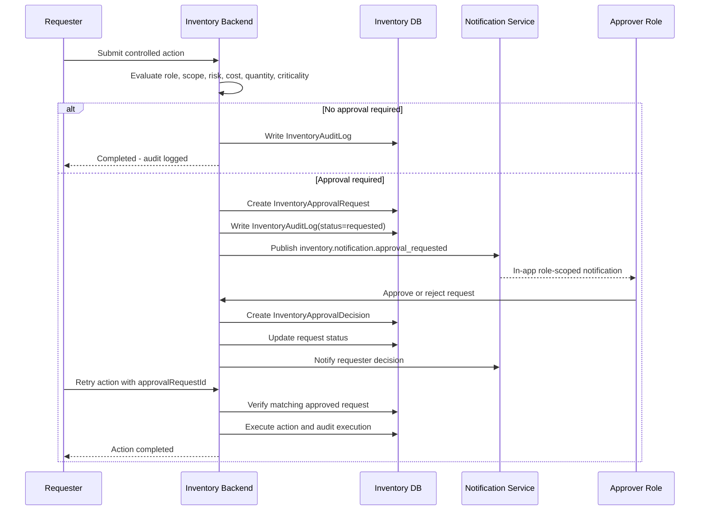
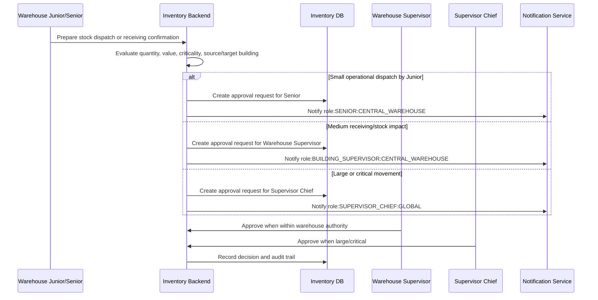

# OpsMind Thesis Update Pack: Inventory, Procurement, RBAC Approval, and ITAM Governance

## Purpose

This file contains thesis-ready replacement and addition sections for aligning the OpsMind thesis/documentation with the current implemented Inventory and Procurement system. It is intended for use when no editable LaTeX or Word thesis source is present in the repository.

Current source status:

- No `.tex` or `.docx` thesis source was found in the repository.
- Existing documentation is Markdown under `docs/`, especially `docs/inventory-ux/` and `docs/deployment/`.
- This update pack should be pasted into the thesis source or used as a Markdown source for a future thesis build pipeline.

Do not claim that auth-service concrete approver lookup or workflow-service generic Inventory approval tasks are implemented. They are documented as future integration.

## 1. Thesis Content Audit Summary

| Thesis area | Required update type | Notes |
| --- | --- | --- |
| Abstract | Minor wording update | Mention Inventory/Procurement approval governance, auditability, and role-scoped notifications if the abstract currently describes only asset tracking. |
| Motivation | New paragraph | Explain why university inventory needs controlled human approval for stock, procurement, and destructive actions. |
| Problem Statement | Minor wording update | Include risks from ungoverned stock movement, procurement spend, and missing audit trails. |
| Aims and Objectives | New objective bullets | Add approval policy evaluation, procurement approval, Central Warehouse control, and auditability. |
| Scope | Minor wording update | Inventory and Procurement are no longer tiny supplementary features; they are major ITAM components. |
| System Overview | New subsection | Add Inventory/Procurement Approval Workflow and service ownership. |
| User Characteristics | New table | Map general OpsMind roles to Inventory approval hierarchy. |
| Functional Requirements | New requirements | Add Inventory approvals, Procurement approvals, Central Warehouse stock control, notifications, audit logs. |
| Interface Requirements | Minor wording update | Add Approval Center and approval-required response states. |
| Non-functional Requirements | New traceability requirement | Add auditability, non-repudiation-style history, and explicit retry behavior. |
| System Design | New subsection | Add approval entities and auth/workflow/notification bridge. |
| ERD/database schema | New table | Add InventoryApprovalPolicy, InventoryApprovalRequest, InventoryApprovalDecision, InventoryAuditLog. |
| Sequence diagrams | New diagrams | Add approval sequence and warehouse dispatch sequence. |
| Human Interface Design | New note | Procurement Approval Center and in-app approval feedback. Screenshots should be captured manually; do not invent screenshots. |
| Testing Plan | New test cases | Add 16 approval/RBAC tests. |
| Traceability Matrix | New rows | Map new functional requirements to implementation/tests. |
| Evaluation | Minor wording update | Mention automated approval tests passed locally if citing current validation. |
| Performance Analysis | Future-work clarification | Do not invent response times. State planned measurement if not measured. |
| User Evaluation | Future-work clarification | Do not invent participant data or SUS scores. |
| Conclusion | New paragraph | Mention approval governance, auditability, and Central Warehouse/procurement control. |
| Future Directions | New bullets | Add concrete auth approver lookup and workflow-service generic approval tasks. |
| Appendices/User Manual | New appendix section | Add role hierarchy, approval matrix, and procurement thresholds. |

## 2. Abstract Addition

OpsMind also implements an Inventory and Procurement governance layer for university IT asset management. The Inventory backend evaluates action risk using role, building scope, cost, quantity, criticality, cross-building impact, and reversibility. Controlled actions create approval requests and decisions, while routine actions are audit-logged without unnecessarily disturbing senior roles. Procurement, Central Warehouse stock movement, receiving, and destructive asset actions are therefore supported by human-controlled approval, role-scoped notification, and traceable audit records.

## 3. Motivation Addition

University IT inventory is not only a list of assets. It includes operational custody, spare stock movement, procurement demand, receiving, audit findings, and eventual retirement or write-off. Without structured approval rules, low-risk work can overload supervisors while high-risk actions can bypass accountability. OpsMind addresses this by separating routine operational activity from controlled, high-impact, or irreversible activity. This supports faster field execution while preserving governance for procurement spending, Central Warehouse stock dispatch, cross-building transfers, and destructive actions.

## 4. Problem Statement Addition

The system must prevent uncontrolled inventory mutations, procurement decisions, stock movements, and destructive asset actions. It must also avoid making approval procedures so heavy that routine tasks become slow. The problem is therefore to design a role-aware and risk-aware approval layer that supports operational speed, human accountability, audit history, and integration with the existing authentication, workflow, and notification architecture.

## 5. Aims and Objectives Additions

Add the following objectives:

- Implement role/scope/action-risk approval evaluation for Inventory and Procurement actions.
- Record approval requests, approval decisions, and audit logs for controlled actions.
- Support cost-based procurement approval thresholds and criticality-based escalation.
- Support Central Warehouse receiving, dispatch, mismatch, and fulfillment approval rules.
- Notify approver roles and requesters through the Notification Service using role-scoped recipients.
- Require explicit execution/retry with `approvalRequestId` before applying approved high-impact actions.
- Preserve the ownership boundary where auth-service owns user identity and notification-service owns notification delivery.

## 6. Updated Scope Statement

Inventory and Procurement are first-class OpsMind service areas. The current implementation includes asset lifecycle management, CMDB relationships, procurement request lifecycle, vendor quotes, purchase orders, receiving, stock controls, AI-supported recommendations, and RBAC approval governance. The implementation does not yet include full ERP accounting, real payment execution, external supplier API integration, concrete auth-service approver lookup by role/building, or generic workflow-service Inventory approval task execution.

## 7. Functional Requirements Additions

| ID | Requirement | Description | Priority |
| --- | --- | --- | --- |
| INV-APR-01 | Inventory Approval Policy Evaluation | The backend shall evaluate inventory actions using actor role, building/scope, action type, cost, quantity, criticality, cross-building impact, and reversibility. | Must |
| INV-APR-02 | Approval Requests | The backend shall create an approval request when a controlled, high-impact, or system-critical action requires human approval. | Must |
| INV-APR-03 | Approval Decisions | The system shall record approve, reject, and escalation decisions with actor, timestamp, reason, and linked request metadata. | Must |
| INV-APR-04 | Audit Logging | The system shall write audit logs for routine actions, approval requests, decisions, overrides, and destructive actions. | Must |
| INV-APR-05 | Explicit Approved Retry | The system shall require explicit retry/execution with a matching approved `approvalRequestId` before applying a previously blocked controlled action. | Must |
| PROC-APR-01 | Procurement Approval Management | The system shall route procurement requests according to amount thresholds, criticality, vendor exceptions, emergency status, and requester role. | Must |
| PROC-APR-02 | Procurement Thresholds | The system shall route EGP 1,001-5,000 to Building Supervisor, EGP 5,001-25,000 to Supervisor Chief, and EGP 25,001+ to Admin. | Must |
| WH-APR-01 | Central Warehouse Receiving Control | The system shall require approval for receiving confirmations that create inventory impact. | Must |
| WH-APR-02 | Central Warehouse Dispatch Control | The system shall route small, large, high-value, and critical warehouse dispatch actions to the appropriate Senior, Building Supervisor, or Supervisor Chief. | Must |
| WH-APR-03 | Stock Mismatch Reporting | The system shall support warehouse mismatch reporting and escalation where stock correction affects quantities. | Should |
| NOTIF-APR-01 | Role-Scoped Approval Notifications | The system shall notify approver role/scope recipients when approval is requested. | Must |
| NOTIF-APR-02 | Requester Decision Notifications | The system shall notify requesters when their approval request is approved, rejected, escalated, or completed. | Should |
| AUD-INV-01 | Inventory Auditability | The system shall retain audit evidence for routine, controlled, and destructive inventory/procurement actions. | Must |

## 8. Inventory Approval Hierarchy and User Characteristics

Inventory approval hierarchy:

Admin -> Supervisor Chief -> Building Supervisor -> Senior -> Junior

Building scopes:

- MAIN
- N
- K
- S
- R
- PHARMACY
- CENTRAL_WAREHOUSE

Each normal building conceptually contains two Juniors reporting to one Senior, one Senior reporting to one Building Supervisor, and each Building Supervisor reporting to the Supervisor Chief. Central Warehouse follows the same hierarchy but has special stock, receiving, and dispatch authority.

| General OpsMind role | Inventory approval role | Main responsibility | Approval authority |
| --- | --- | --- | --- |
| Technician / Junior | Junior | Field execution, scanning, notes, audits, issue reporting | No procurement/destructive approval; can submit requests/reports |
| Senior Technician | Senior | Building operational validation | Approves junior reports and small operational requests |
| Supervisor | Building Supervisor | Building-level control | Approves medium procurement, internal building transfers, controlled stock and ownership actions |
| Supervisor Chief | Supervisor Chief | Cross-building and high-impact governance | Approves cross-building transfers, high-value procurement, critical stock decisions |
| Admin | Admin | System-critical authority | Approves destructive, financial override, policy, permission, and very high-cost actions |

## 9. System Design: Inventory/Procurement Approval Workflow

The approval workflow is implemented as an Inventory-local approval engine. This is a deliberate bridge design because workflow-service currently supports ticket workflow, escalation, hierarchy sync, and reporting relationships, but does not yet provide a generic approval-task execution API for Inventory and Procurement actions.

Implemented approval entities:

- `InventoryApprovalPolicy`: stores policy defaults and action-risk mappings.
- `InventoryApprovalRequest`: stores the requested controlled action, requester, role, scope, entity, amount, quantity, and approval status.
- `InventoryApprovalDecision`: records approval, rejection, and escalation decisions.
- `InventoryAuditLog`: records routine actions, approval requests, decisions, overrides, and controlled action execution.

Ownership model:

| Service | Current responsibility |
| --- | --- |
| Auth service | Owns users, login, roles, and building assignments where already modeled. It does not currently expose concrete Inventory approver lookup by role/building. |
| Workflow service | Owns ticket workflow, ticket escalation, technician hierarchy sync, and reporting relationships. Generic Inventory approval task execution is future work. |
| Inventory backend | Owns inventory-specific action context, risk classification, approval policy mapping, approval requests, approval decisions, and audit logs. |
| Notification Service | Owns notification delivery and persistence. Inventory sends approval events through the existing notification event route. |

Current notification bridge:

- Approval requested events use `inventory.notification.approval_requested`.
- Approval approved/rejected/escalated/completed events use corresponding `inventory.notification.*` routing keys.
- Notification recipients remain role-scoped where concrete auth lookup is unavailable.

Example role-scoped recipients:

- `role:SENIOR:MAIN`
- `role:BUILDING_SUPERVISOR:MAIN`
- `role:SENIOR:CENTRAL_WAREHOUSE`
- `role:BUILDING_SUPERVISOR:CENTRAL_WAREHOUSE`
- `role:SUPERVISOR_CHIEF:GLOBAL`
- `role:ADMIN:GLOBAL`

## 10. Approval Risk Levels

| Risk level | Meaning | Typical outcome |
| --- | --- | --- |
| L0_ROUTINE | Routine operational action | Auto-approved, audit only |
| L1_OPERATIONAL | Low operational risk, often junior-submitted | Senior approval when required |
| L2_CONTROLLED | Cost, ownership, stock, or controlled inventory impact | Building Supervisor approval |
| L3_HIGH_IMPACT | Cross-building, high-value, critical, or large movement | Supervisor Chief approval |
| L4_SYSTEM_CRITICAL | Destructive, policy, financial override, or very high-cost action | Admin approval |

Do-not-disturb rule:

Only escalate when the action creates risk, cost, loss, cross-scope impact, security/compliance impact, or irreversible change. Routine low-risk work should be audit-logged without disturbing higher roles.

## 11. Approval Policy Matrix

| Action category | Example action | Risk level | Required approver | Notification target | Audit required |
| --- | --- | --- | --- | --- | --- |
| Routine asset work | QR scan, note/photo, minor status note | L0_ROUTINE | None | Optional/none | Yes |
| Junior operational report | Damage, missing, repair, audit discrepancy | L1_OPERATIONAL | Senior | `role:SENIOR:<building>` | Yes |
| Assignment or ownership change | Valuable internal transfer, ownership change | L2_CONTROLLED | Building Supervisor | `role:BUILDING_SUPERVISOR:<building>` | Yes |
| Procurement medium value | EGP 1,001-5,000 request | L2_CONTROLLED | Building Supervisor | `role:BUILDING_SUPERVISOR:<building>` | Yes |
| Procurement high value | EGP 5,001-25,000 request | L3_HIGH_IMPACT | Supervisor Chief | `role:SUPERVISOR_CHIEF:GLOBAL` | Yes |
| Procurement very high value | EGP 25,001+ request | L4_SYSTEM_CRITICAL | Admin | `role:ADMIN:GLOBAL` | Yes |
| Cross-building transfer | N Building to K Building asset transfer | L3_HIGH_IMPACT | Supervisor Chief | Supervisor Chief and relevant building roles | Yes |
| Warehouse small dispatch | Junior prepares small stock dispatch | L1_OPERATIONAL | Central Warehouse Senior | `role:SENIOR:CENTRAL_WAREHOUSE` | Yes |
| Warehouse receiving confirmation | Receiving with inventory impact | L2_CONTROLLED | Central Warehouse Building Supervisor | `role:BUILDING_SUPERVISOR:CENTRAL_WAREHOUSE` | Yes |
| Large warehouse dispatch | Large/high-value spare stock movement | L3_HIGH_IMPACT | Building Supervisor or Supervisor Chief depending actor/impact | Warehouse supervisor or Supervisor Chief | Yes |
| Destructive asset action | Permanent delete, write-off, system stock correction | L4_SYSTEM_CRITICAL | Admin | `role:ADMIN:GLOBAL` | Yes |

## 12. Central Warehouse Rules

Central Warehouse Junior:

- pick items
- scan items
- prepare dispatch
- report stock mismatch
- draft receiving quantity
- needs Senior approval for quantity confirmation, damage, adjustment, or mismatch confirmation

Central Warehouse Senior:

- validate receiving
- confirm spare stock counts
- approve small stock issue
- prepare stock transfer
- needs Warehouse/Building Supervisor approval for large stock issue, high-value spare part dispatch, bulk transfer, or stock correction

Central Warehouse Supervisor:

- approve stock fulfillment
- approve PO receiving inventory impact
- approve warehouse-to-building dispatch
- manage warehouse stock levels
- needs Supervisor Chief approval for large cross-building allocation, critical shortage decision, emergency distribution, high-value movement, or high-impact stock correction

## 13. Procurement Approval Rules

| Amount range | Approver | Notes |
| --- | --- | --- |
| EGP 0-1,000 | Auto-approved or Senior | Depends on actor/request type; audit always required |
| EGP 1,001-5,000 | Building Supervisor | Normal medium-value procurement |
| EGP 5,001-25,000 | Supervisor Chief | High-impact procurement |
| EGP 25,001+ | Admin | Very high-cost procurement |

Additional procurement escalation:

- Critical/security/server/network assets escalate to Supervisor Chief or Admin depending amount and criticality.
- New vendor exceptions should route to Supervisor Chief/Admin.
- Emergency high-value purchases route to Supervisor Chief first, then Admin if above threshold or financial override is required.

## 14. Sequence Diagram: Inventory/Procurement Approval

## 15. Sequence Diagram: Central Warehouse Dispatch Approval

## 16. Database Table Summary

| Table/model | Purpose |
| --- | --- |
| InventoryApprovalPolicy | Defines approval policy defaults, action types, risk levels, and approver roles. |
| InventoryApprovalRequest | Stores controlled action requests waiting for approval or decision. |
| InventoryApprovalDecision | Stores approve/reject/escalate decisions and decision metadata. |
| InventoryAuditLog | Stores routine, approval, decision, override, and destructive-action audit events. |
| ProcurementRequest | Stores procurement demand, status, source, priority, department/building, and requester data. |
| ProcurementRequestItem | Stores items requested, quantities, cost estimates, linked assets/stock/license context. |
| ProcurementApproval | Stores procurement status/approval history. |
| VendorQuote | Stores quote options, price, warranty, delivery, reliability notes, and selected/rejected status. |
| PurchaseOrder | Stores PO records linked to procurement requests. |
| ReceivingRecord | Stores receiving events and inventory impact metadata. |
| InventoryStockBatch | Stores FIFO-compatible received stock batches where implemented. |
| InventoryStockMovement | Stores stock issue/receipt movement history where implemented. |

## 17. Testing Plan Additions

| Test ID | Scenario | Expected result | Automated status |
| --- | --- | --- | --- |
| RBAC-01 | Junior QR scan | Auto-approved, audit only | Covered |
| RBAC-02 | Junior damage report | Senior approval required | Covered |
| RBAC-03 | Junior missing asset report | Senior approval required | Covered |
| RBAC-04 | Junior repair request | Senior approval required | Covered |
| RBAC-05 | Junior audit discrepancy | Senior approval required | Covered |
| RBAC-06 | Senior medium procurement | Building Supervisor approval required | Covered |
| RBAC-07 | Building Supervisor cross-building transfer | Supervisor Chief approval required | Covered |
| RBAC-08 | Supervisor Chief write-off/delete | Admin approval required | Covered |
| RBAC-09 | Admin destructive action | Allowed but audited | Covered |
| RBAC-10 | Warehouse small dispatch | Central Warehouse Senior approval | Covered |
| RBAC-11 | Warehouse large dispatch | Warehouse Supervisor or Supervisor Chief depending impact | Covered |
| RBAC-12 | Warehouse receiving confirmation | Warehouse Supervisor approval for inventory impact | Covered |
| RBAC-13 | Procurement EGP 30,000 | Admin approval required | Covered |
| RBAC-14 | Junior/Senior cross-building transfer execution | Denied/direct execution blocked | Covered |
| RBAC-15 | Approval notification payload | Correct role/scope event emitted | Covered |
| RBAC-16 | Approved retry guard | Explicit matching approved `approvalRequestId` required | Covered |

Latest local validation reported the targeted Inventory backend approval/import suite passing 19 tests. Do not report broader production readiness from this number; it only covers targeted backend approval/import behavior.

## 18. Requirements Traceability Additions

| Requirement | Implementation evidence | Test/evaluation evidence |
| --- | --- | --- |
| INV-APR-01 | `inventoryApprovalService.ts` risk evaluator | `inventoryApprovalPolicy.test.ts` |
| INV-APR-02 | `InventoryApprovalRequest` model and approval routes | Approval policy tests and route smoke/manual testing |
| INV-APR-03 | `InventoryApprovalDecision` model and approve/reject routes | Approval Center/manual QA |
| INV-APR-04 | `InventoryAuditLog` model and audit writer | Approval policy and approval notification tests; manual audit review |
| INV-APR-05 | `hasApprovedInventoryRequest` guard | Explicit approved retry unit test |
| PROC-APR-01 | Procurement approval action types and thresholds | Procurement threshold policy tests |
| WH-APR-01 | Warehouse receiving action/risk mapping | Warehouse receiving confirmation test |
| WH-APR-02 | Warehouse dispatch action/risk mapping | Warehouse small/large dispatch tests |
| NOTIF-APR-01 | `sendInventoryApprovalNotification` and notification consumer | Approval notification test |

## 19. Performance and Evaluation Honesty

No response-time benchmark values, production throughput numbers, participant counts, or SUS scores should be invented. If no measured values are available, use this wording:

Performance benchmarking for the approval workflow remains planned work. The current validation confirms functional correctness through targeted automated tests and local build checks, but it does not establish production latency, throughput, or concurrency limits.

User evaluation remains planned unless participant data and SUS results are available. The thesis should describe the intended evaluation method and avoid reporting uncollected scores.

## 20. Conclusion Addition

The Inventory and Procurement modules now provide more than asset registration. They include role-aware governance for procurement, Central Warehouse stock movement, cross-building transfer, destructive actions, and auditability. By combining local Inventory approval records, role-scoped notifications, explicit approved-action retry, and audit logs, OpsMind supports human-controlled operational safety while preserving practical speed for routine work.

## 21. Future Work Additions

- Implement concrete auth-service approver lookup by role and building.
- Add workflow-service generic Inventory approval tasks and link them to InventoryApprovalRequest records.
- Create real production approver accounts and role assignments through auth-service.
- Add deeper procurement finance and budget enforcement.
- Add Inventory-to-ticket linking for maintenance, incident, and problem workflows.
- Expand predictive asset lifecycle and EOL analysis.
- Add richer warehouse stock forecasting and exception analytics.
- Complete full browser QA and production performance benchmarks.
- Add user evaluation results and SUS score analysis once real study data exists.
